# Instant Cyber Security

## AltoroMutual Exam Final Report


## Mohamed Abolyazeed


---

## Table of Contents

1. Executive Summary
   - Scope of Engagement
2. Tools
   - WhatWeb
   - gobuster
3. Test Scenario
4. Detailed Findings
   - SQL Injection
   - Cross-site scripting (XSS)
   - File Inclusion
   - CSRF
   - Authentication
   - URL Redirection Attack
   - ClickJacking
   - Link Injection
   - Server Leaks Version Information
   - Information Disclosure
   - Time Delay Attack
   - Additional Security Findings

---

## 1. Executive Summary

- Scope of Engagement

  - I requested to perform a black-box penetration testing across the following:
    - Target Domain: <http://altoro.testfire.net>
    - Subdomains: Any subdomains associated with the main domain.
    - Tools Used: Gobuster (for DNS enumeration).

- Found the following in-scope subdomains:
  - IP address: 65.61.137.117
  - Target: <http://altoro.testfire.net>

---

## 2. Tools

### 2.1. What Web

- Web Server Identification
  - HTTPServer[Apache-Coyote/1.1]
- Session Handling
  - Cookies[JSESSIONID]
- Technology Information
  - Java
- Country
  - Country[UNITED STATES][US]

---

## 3. Test Scenario

- First, I started to read carefully the letter of engagement to see in detail the web penetration test scope, objectives, report mandatory points and the recommended tools.

- The penetration test scope was clearly defined to test the domain "<http://altoro.testfire.net>" and DNS 65.61.137.117 and any subdomains related to this main domain.

- The subdomain enumeration scan using gobuster did not return any results. No subdomains were discovered.

---

### 3.1. Scope of Engagement

- Target Domain: <http://altoro.testfire.net>
- Subdomains: Any subdomains associated with the main domain
- Tools Used: gobuster (for DNS enumeration)

---

### 3.2. Command

- Install Word List: `sudo apt install wordlists`
- `gobuster dns -d altoro.testfire.net -w /usr/share/dnsmap/wordlist_TLAs.txt`
- Wordlist: `/usr/share/dnsmap/wordlist_TLAs.txt`

---

### 3.3. Observations

- The scan targeted <http://altoro.testfire.net> using a DNS enumeration with the following configuration:
  - 10 concurrent threads
  - 1 second timeout
  - Wordlist: `/usr/share/dnsmap/wordlist_TLAs.txt`
- Key Findings:
  - The scan was unable to validate the base domain, receiving a "no such host" error
  - The target domain appears to be inaccessible or non-existent at the time of scanning

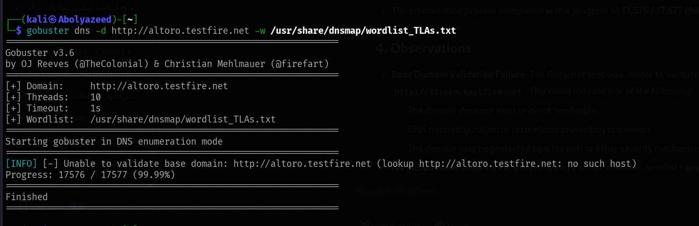

---

## 4. Detailed Findings

### 4.1. SQL Injection

- 4.1.1- SQL injection vulnerability allowing login bypass

  
  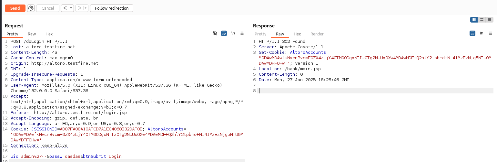
  
  
  

- 4.1.2- Login Bypass Authentication with SQL Injection

  - URL: <http://testfire.net/login.jsp>
    - Risk: High
    - Confidence: High
    - Threat Classification: SQL Injection
    - Evidence: Server: Apache-Coyote/1.1
    - Description: SQL injection is a code injection technique used to attack data-driven applications, in which malicious SQL statements are inserted into an entry field for execution (e.g. to dump the database contents to the attacker). SQL injection must exploit a security vulnerability in an application's software, for example, when user input is either incorrectly filtered for string literal escape characters embedded in SQL statements or user input is not strongly typed and unexpectedly executed.

  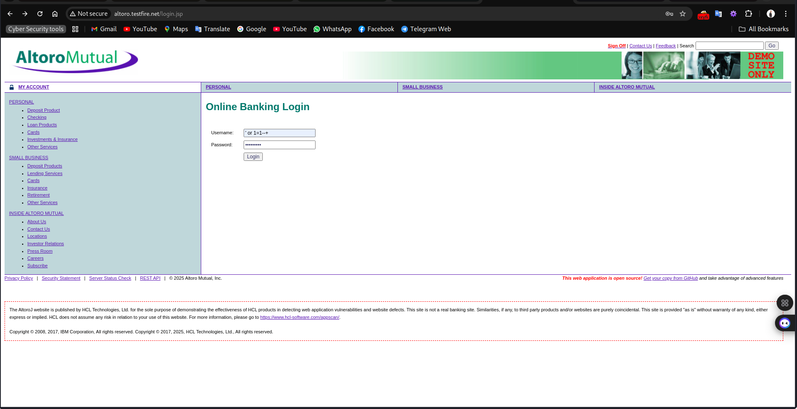

  - Using SQL injection to log in to the website, assuming "admin" as the default username. Also, use the `' OR '1'='1` SQL query to bypass the password.
  - After hitting the login button we sign in as administrators.

  

- 4.1.3- SQL Injection in Feedback Form

  - URL: <http://altoro.testfire.net/sendFeedback>
  - Risk: High
  - Confidence: Medium
  - Attack: `comments.txt' AND '1'='1' --`
  - Description: SQL injection may be possible

    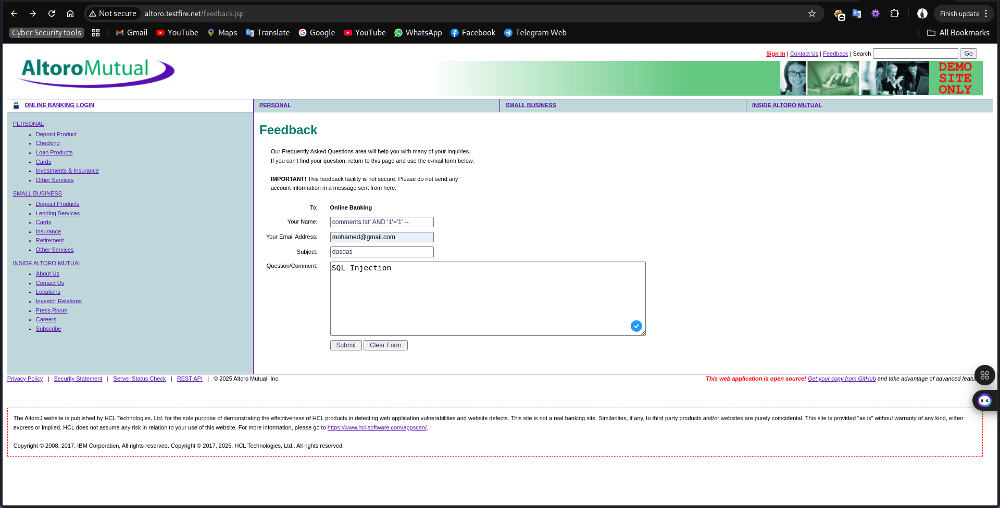
    

- Additional SQL Injection Findings

  
  

---

### 4.2. XSS

- 4.2.1- Cross Site Scripting (Reflected)

  - URL: <http://altoro.testfire.net/search.jsp?query=%3C%2Fp%3E%3CscrIpt%3Ealert%281%29%3B%3C%2FscRipt%3E%3Cp%3E>
  - Risk: High
  - Confidence: Medium
  - Attack: `<script>alert("Mohamed");</script>`
  - Description: Cross-site Scripting (XSS) is an attack where malicious code, often in HTML/JavaScript, is injected into a user's browser, running within the security context of a trusted site. This can hijack accounts, redirect browsers, or display fake content, breaking user-website trust. XSS comes in three flavors: non-persistent (malicious links/forms), persistent (stored malicious content like forum posts), and DOM-based (client-side script manipulation). Each exploits vulnerabilities to execute harmful scripts without the user's knowledge

  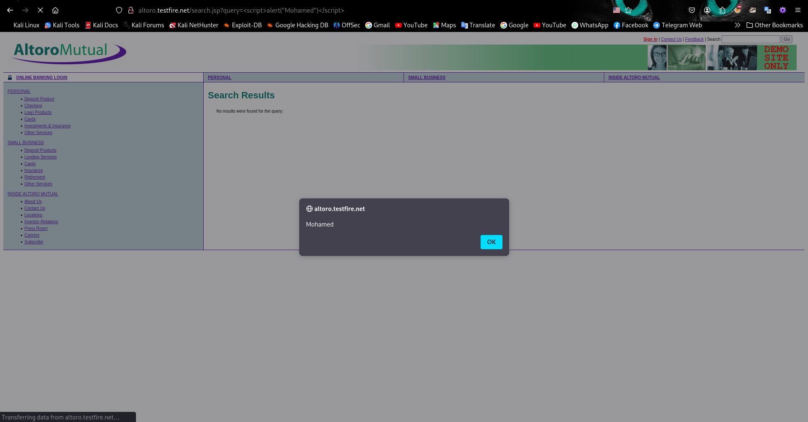

- 4.2.2- Stored XSS in innerHTML sink using source location.search

  - URL: <http://altoro.testfire.net/search.jsp?query=%3Cimg+src%3Dx+onerror%3Dalert%28%27XSS%27%29%3E>
  - Risk: High
  - Confidence: Medium
  - Attack: ``

  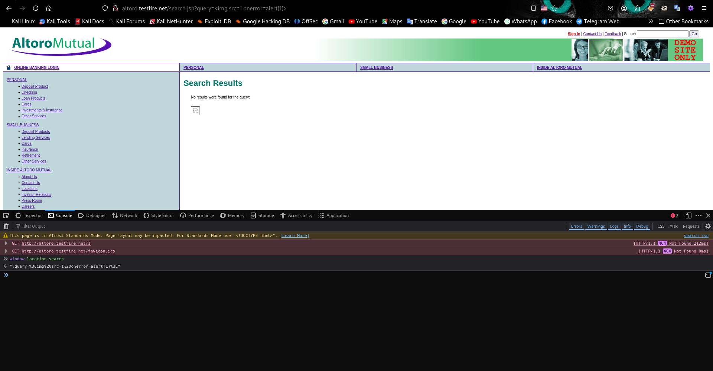

- 4.2.3- DOM XSS in jQuery anchor href attribute sink using location.search source

  - URL: <http://altoro.testfire.net/search.jsp?query=%3Cimg+src%3Dx+onerror%3Dalert%28%27XSS%27%29%3E>
  - Risk: High
  - Confidence: Medium
  - Attack: `javascript:alert(document.cookie)`

  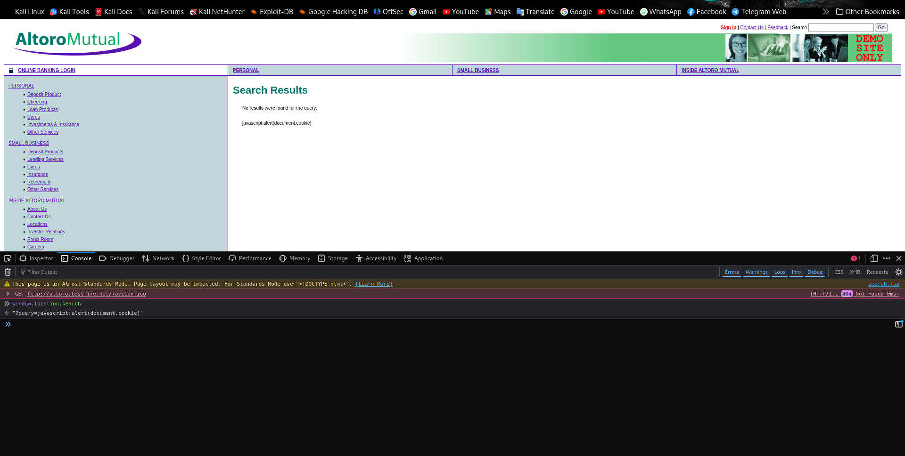

- 4.2.4- Vulnerability: Stored Cross-Site Scripting (XSS) in the "Feedback" Form

  - URL: <http://altoro.testfire.net/sendFeedback>
  - Risk: High
  - Confidence: Medium
  - Attack: ``
  - Description: Cross-site Scripting (XSS) is an attack technique that involves echoing attacker-supplied code into a user's browser instance. A browser instance can be a standard web browser client, or a browser object embedded in a software product such as the browser within WinAmp, an RSS reader, or an email client. The code itself is usually written in HTML/JavaScript, but may also extend to VBScript, ActiveX, Java, Flash, or any other browser-supported technology
  - Recommendations:
    - Input Validation: Implement strict input validation and sanitization for all user-supplied data. This could involve:
      - Whitelisting: Only allow specific characters and HTML tags
      - Blacklisting: Remove or escape known malicious characters and sequences.
      - Encoding: Encode user-supplied data before displaying it on the page
      - Output Encoding: Even with input validation, output encoding is crucial to prevent XSS vulnerabilities. Encode special characters that could be interpreted as HTML tags before displaying them in the "Thank You" message

  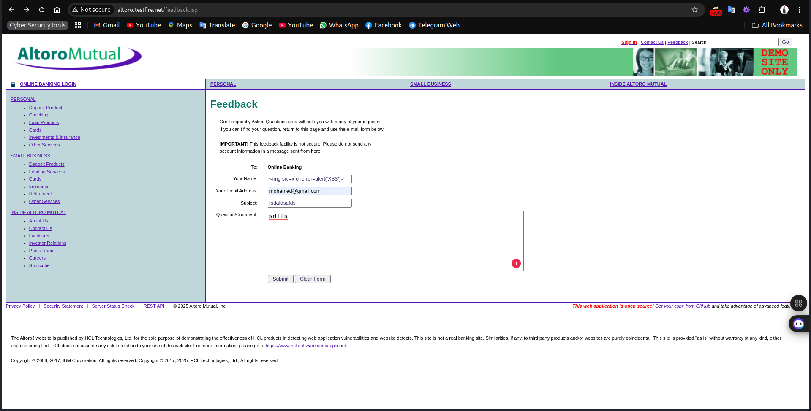
  
  

- 4.2.5- Reflected XSS with HTML Injection

  - URL: <http://altoro.testfire.net/search.jsp?query=%3Ch1%3E+Mohamed+%3C%2Fh1%3E+%3Cp%3E+Haker+%3Cp%3E+%3Cp%3EClick+%3Ca+href%3D%22https%3A%2F%2Fwww.google.com%22%3Ehere%3C%2Fa%3E+to+go+to+Google.%3C%2Fp%3E3E>
  - Risk: High
  - Confidence: Medium
  - Attack: `<h1> Mohamed </h1> <p> Haker <p> <p>Click <a  href="https://www.google.com">here</a> to go to Google.</p>`
  - 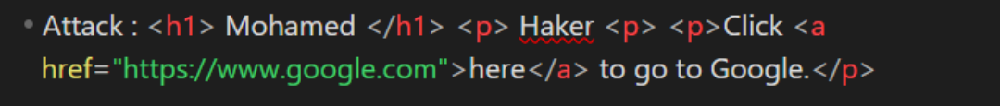
  - 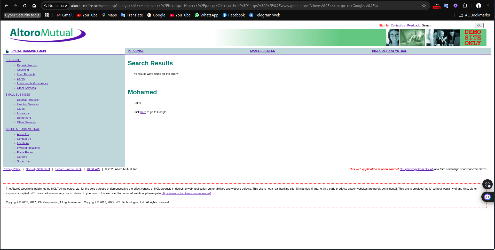

- 4.2.6- Reflected XSS in Customize Page
  - URL: <http://altoro.testfire.net/bank/customize.jsp?content=customize.jsp&lang=%3Cimg%20src=x%20onerror=alert(%27XSS%27)%3E>
  - Risk: High
  - Confidence: Medium
  - Attack: ``
  - 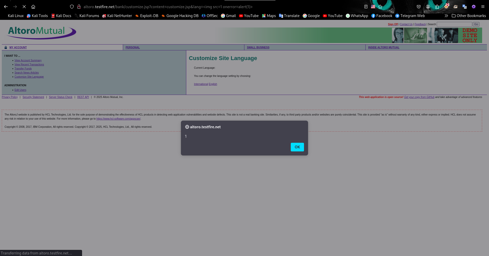
  - 

---

### 4.3. File Inclusion

- 4.3.1- Cross-Domain JavaScript Source File Inclusion
  - URL: <http://altoro.testfire.net/index.jsp?content=personal_investments.htm>
  - Risk: Low
  - Confidence: Medium
  - Parameter: <http://demo-analytics.testfire.net/urchin.js>
  - Evidence: `<script src="http://demo-analytics.testfire.net/urchin.js" type="text/javascript"> </script>`
  - Description: The page includes one or more script files from a third-party domain
- 

---

### 4.4. CSRF

- 4.4.1- Absence of Anti-CSRF Tokens
  - URL: <http://altoro.testfire.net/sendFeedback>
  - Risk: Medium
  - Confidence: Low
  - From:
    ```
    <form id="frmSearch" method="get" action="/search.jsp">
    ```
    - 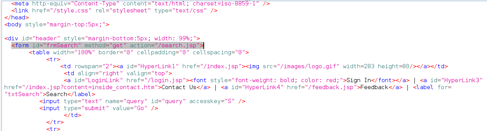
    - 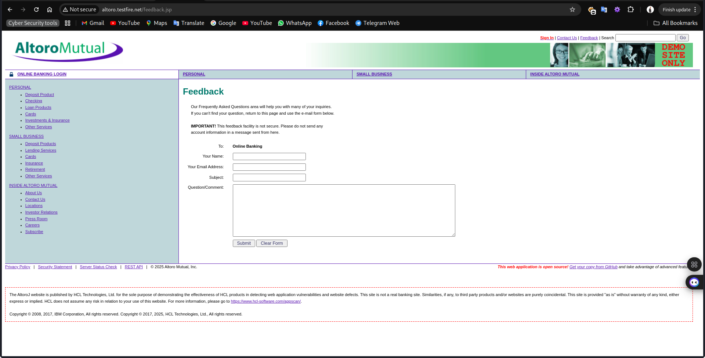
  - 

---

### 4.5. Authentication

- 4.5.1- Insecure Cookies
  - URL: <http://altoro.testfire.net/bank/main.jsp>
  - Risk: High
  - Confidence: High
  - Threat Classification: Update Information Account
  - Attack: Update Cookie
  - 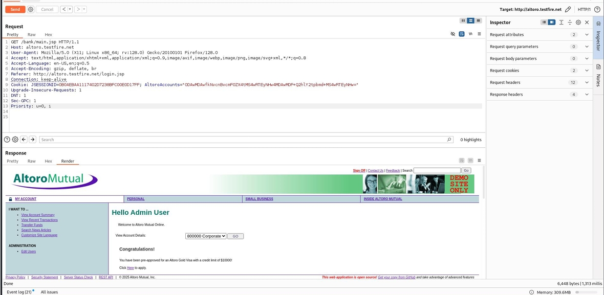
  - 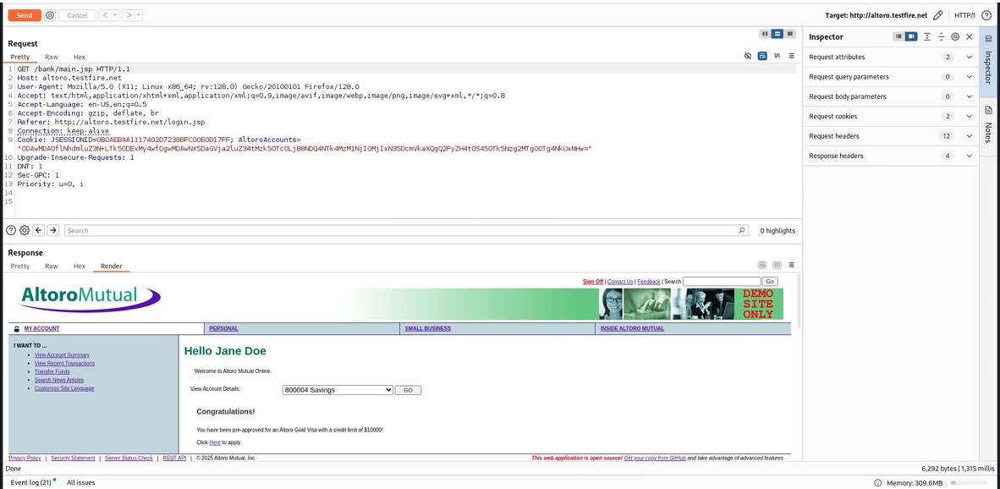

---

### 4.6. URL Redirection Attack

- 4.6.1- URL Redirection Attack
  - URL: <http://altoro.testfire.net/bank/customize.jsp>
  - Risk: Medium
  - Confidence: High
  - Threat Classification: URL Redirector Abuse
  - Description: URL redirectors represent common functionality employed by web sites to forward an incoming request to an alternate resource. This can be done for a variety of reasons and is often done to allow resources to be moved within the directory structure and to avoid breaking functionality for users that request the resource at its previous location. It is this last implementation which is often used in phishing attacks as described in the example below. URL redirectors do not necessarily represent a direct security vulnerability but can be abused by attackers trying to social engineer victims into believing that they are navigating to a site other than the true destination.
  - Attack: `/bank/customize.jsp?content=https://www.google.com&lang=international%20HTTP/1.1 HTTP/1.1`
    - 
    - 

---

### 4.7. ClickJacking

- 4.7.1- ClickJacking
  - URL: <http://altoro.testfire.net/index.jsp>
  - Risk: Medium
  - Confidence: High
  - Threat Classification: URL Redirector Abuse
  - Attack: Folder Name ==> attack(ClickJacking)
  - Description: The application can be embedded in malicious iframes allowing an attacker to hijack the user clicks to perform actions without the user consent.
  - 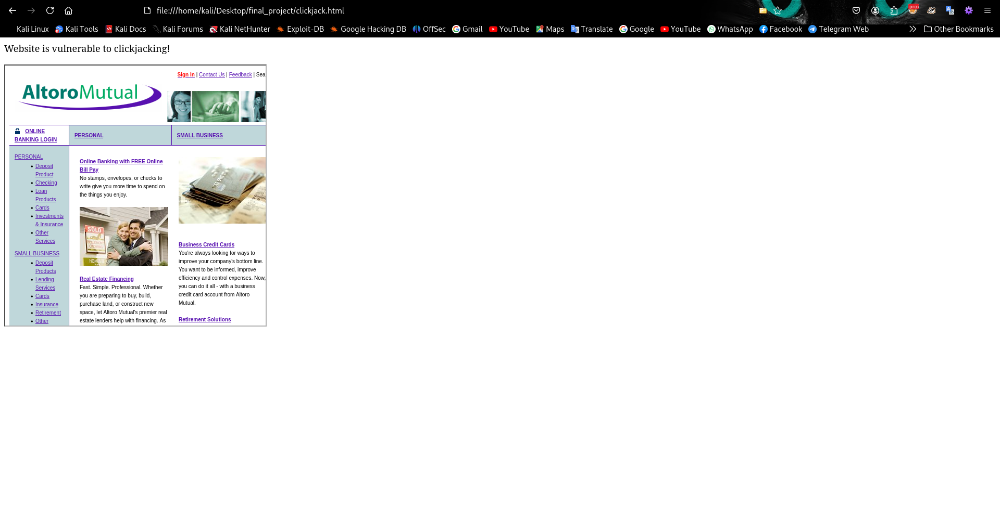

---

### 4.8. Link Injection

- 4.8.1- Link Injection
  - URL: <http://altoro.testfire.net/index.jsp>
  - Risk: Medium
  - Confidence: High
  - Threat Classification: Content Spoofing
  - Description: URL Injection occurs when a hacker has created/injected new pages on an existing website. These pages often contain code that redirects users to other sites or involves the business in attacks against other sites. These injections can be made through software vulnerabilities, unsecured directories, or plug-ins.
  - Attack:
  - 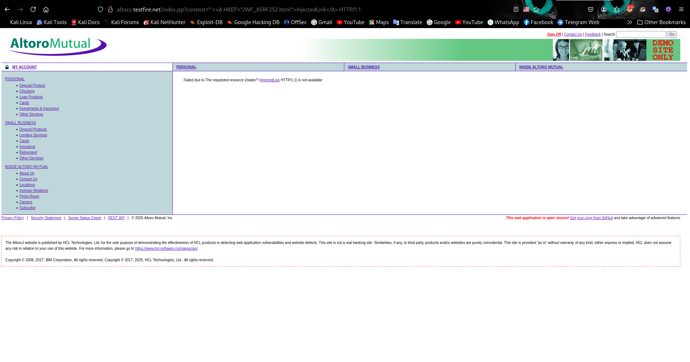
  - 

---

### 4.9. Server Leaks Version Information

- 4.9.1- Server Leaks Version Information
  - URL: <http://altoro.testfire.net/index.jsp>
  - Risk: Low
  - Confidence: High
  - Threat Classification: Information Leakage
  - Evidence: Server: Apache-Coyote/1.1
  - Description: The web/application server is leaking version information via the "Server" HTTP response header. Access to such information may facilitate attackers identifying other vulnerabilities your web application server is subject to.
  - 

---

### 4.10.1 Information Disclosure

- 4.10.1 Information Disclosure

  - URL: <http://altoro.testfire.net/login.jsp>
  - Risk: Low
  - Confidence: High
  - Threat Classification: Information Leakage
  - Evidence: admin
  - Description: The response appears to contain suspicious comments which may help an attacker.
  - 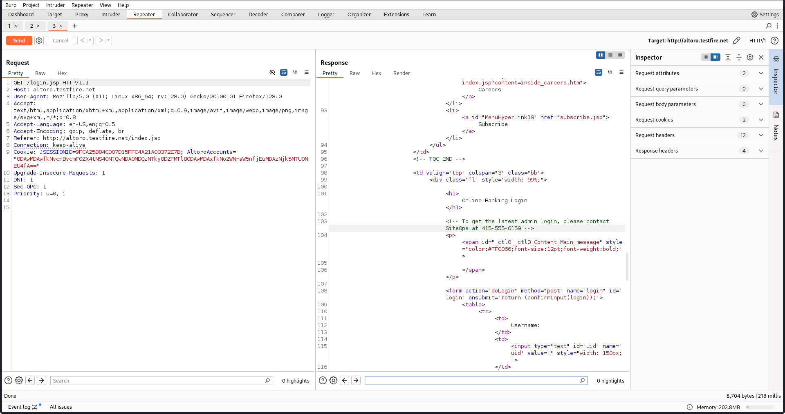

- 4.10.2 Information Disclosure
  - URL : http://altoro.testfire.net/index.jsp?content=inside_jobs.htm
  - Risk : Informational
  - Confidence : Low
  - Threat Classification : Information Leakage
  - Evidence : admin
  - Description : The response appears to contain suspicious comments which may
    help an attacker. Note: Matches made within script blocks or files are against
    the entire content not only comments
    - 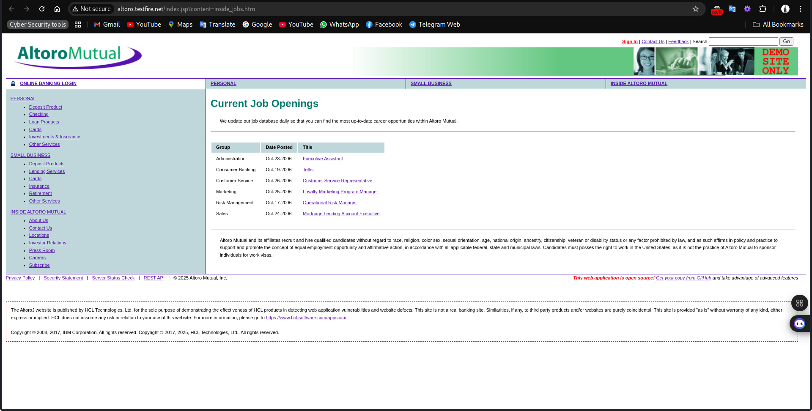
    - 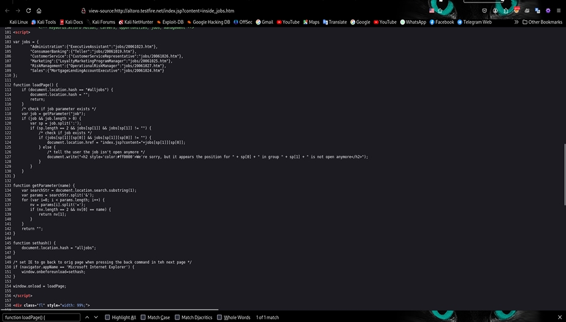

---

### 4.11. Authorization

- 4.11.1 Insecure Direct Object Reference
- URL : http://altoro.testfire.net/bank/main.jsp
- Risk : High
- Confidence : High
- Attack : convert URL  http://altoro.testfire.net/admin/admin.jsp
- Threat Classification : All user information leaked
- Description : I was able to access highly sensitive information and perform administrative actions that should only be available to system administrators. Specifically, I could:
  1- View the list of usernames in the system.
  2- Add new users to the system.
  3- Modify existing user accounts.
  These actions and information should be to administrators only

  - 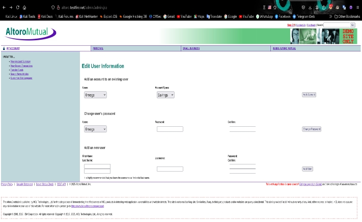

- 4.11.2 Insecure Direct Object Reference
  - URL : http://altoro.testfire.net/bank/main.jsp
  - Risk : High
  - Confidence : High
  - Attack : convert URL  http://altoro.testfire.net/admin/admin.jsp
  - Threat Classification : All user information leaked
  - Description: A vulnerability was discovered in the account history where modifying the URL parameter allows unauthorized access to another user’s account details. This indicates an improper authorization check - Recommendation : Ensure proper authorization checks are in place for each request Validate user permissions thoroughly and use non-predictable identifiers for URLs. -  -  - 

---
