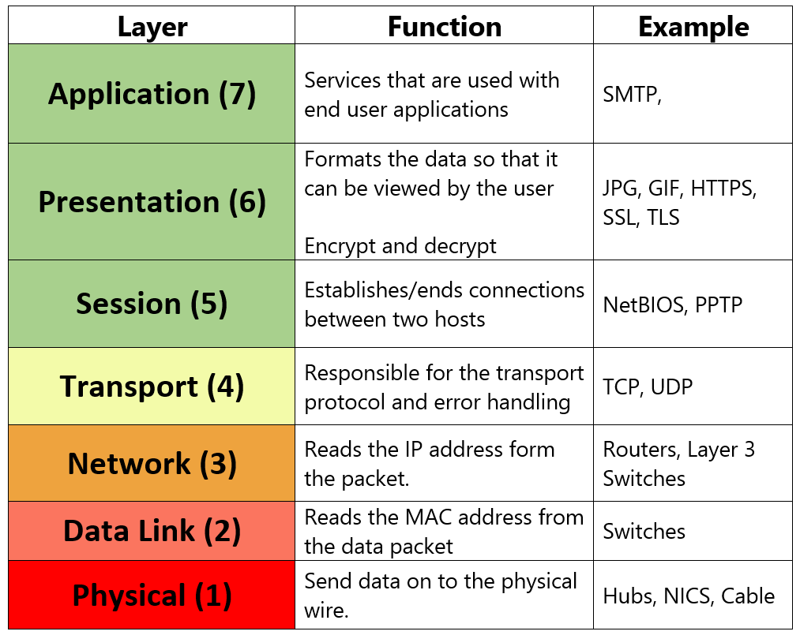

# 🌐 Understanding the OSI Model in Practice: Linking Layers to Real-World Issues & Troubleshooting



---

## 📌 المقدمة: لماذا نموذج OSI هو البوصلة الحقيقية للتشخيص؟
كثير من العاملين في مجال تكنولوجيا المعلومات والأمن السيبراني يتعاملون مع نموذج **OSI (Open Systems Interconnection)** كأنه مجرد 7 طبقات للحفظ النظري في الاختبارات. لكن القيمة الحقيقية للنموذج تكمن في كونه **الخريطة الذهنية الموحدة لتشخيص الأعطال (Troubleshooting Mental Model)**.

عندما يحدث عطل في الشبكة أو يتعذر الوصول إلى خدمة ما، يتيح لك نموذج OSI:
* **تفكيك المشكلة المعقدة** إلى أجزاء أصغر يمكن اختبار كل منها بشكل مستقل.
* **عزل السبب الجذري (Root Cause Isolation)** دون إضاعة الوقت في تخمين عشوائي.
* **معرفة الأداة المناسبة** لفحص كل مستوى على حدة (من فحص كابل أو منفذ سويتش، إلى فحص مسار التوجيه أو ترويسات التطبيق).

---

## ⚠️ تنبيه مفاهيمي: نموذج OSI النظري مقابل واقع حزم البيانات (OSI vs. Reality)

قبل البدء في تحليل الطبقات، من الضروري إدراك نقطة جوهرية تمنع الوقوع في أخطاء تشخيصية شائعة:

> [!NOTE]
> **نموذج OSI هو إطار مرجعي للفهم والتشخيص (Conceptual & Diagnostic Framework):**
> 1. **الواقع العملي يعتمد على عائلة TCP/IP:** في الشبكات الحقيقية وأدوات تحليل الحزم مثل **Wireshark**، لن تشاهد 7 طبقات منفصلة لكل Packet. ستشاهد الحزمة بهيكلية بروتوكولات TCP/IP الفعلية:
>    $$\text{Ethernet Frame (L2)} \longrightarrow \text{IP Packet (L3)} \longrightarrow \text{TCP/UDP Segment (L4)} \longrightarrow \text{Application / Data (Payload)}$$
> 2. **الربط بين التقنيات والطبقات هو ربط تقريبي لغرض الدراسة والتشخيص:**
>    * **بروتوكول TLS/SSL:** وظيفياً يؤدي مهام التشفير والمصافحة قبل تبادل بيانات التطبيق، لذا يُشرح غالباً ضمن طبقة العرض (L6) أو كطبقة أمان فوق النقل، لكنه في الواقع يعمل كحمولة تعلو TCP مباشرة.
>    * **بروتوكولات مثل SMB و Kerberos:** هي بروتوكولات مركبة تتداخل فيها وظائف إدارة الجلسات (L5) والتوثيق والترميز (L6) وطلب الملفات والخدمات (L7).

---

## 🔄 رحلة البيانات عمليًا: ماذا يحدث عند فتح `https://example.com/login`؟

عندما تكتب الرابط في المتصفح وتضغط Enter، لا يتم إرسال طلب الويب فوراً، بل تمر العملية بسلسلة خطوات مرتبة لا غنى عنها:

```plaintext
1. DNS Resolution (حل الاسم إلى عنوان IP)
   ├── فحص الكاش المحلي (Browser Cache & OS Hosts file)
   └── إرسال طلب DNS (عبر UDP/53) إلى الـ DNS Resolver للحصول على عنوان IP الخادم.

2. Routing Decision & ARP (قرار التوجيه ومعرفة الـ MAC)
   ├── مقارنة IP الخادم مع عنوان الجهاز وقناع الشبكة (Subnet Mask):
   │   ├── إذا كان في نفس الشبكة المحلية: إرسال ARP Request لمعرفة MAC الخادم مباشرة.
   │   └── إذا كان في شبكة خارجية/الإنترنت: تحديد أن الحزمة يجب أن تذهب للـ Gateway.
   └── فحص ARP Cache أو إرسال طلب ARP لمعرفة MAC Address الخاص بالـ Default Gateway.

3. TCP 3-Way Handshake (تأسيس الاتصال بالمنفذ 443 - L4)
   ├── Client  ───[ SYN ]───>  Server   (طلب بدء الاتصال ومزامنة الـ ISN)
   ├── Client  <──[ SYN-ACK ]── Server   (الموافقة وتأكيد الاستلام)
   └── Client  ───[ ACK ]───>  Server   (اكتمال الاتصال وجاهزية نقل البيانات)

4. TLS Handshake (التفاوض الأمني والتشفير)
   ├── إرسال Client Hello (الإصدارات والـ Cipher Suites المدعومة).
   ├── استلام Server Hello + شهادة السيرفر الرقمية (Digital Certificate).
   ├── التحقق من صحة الشهادة وسلسلة الثقة (CA Chain).
   └── توليد مفاتيح التشفير المتماثلة (Symmetric Session Keys) لتشفير الجلسة.

5. Encrypted HTTP Request (إرسال طلب التطبيق - L7)
   ├── المتصفح ينشئ طلب: GET /login HTTP/1.1
   └── يتم تشفير الطلب عبر مفتاح الجلسة، ثم تغليفه في TCP -> IP -> Ethernet وإرساله كـ Bits.
```

---

## 🧱 التشريح العملي للطبقات السبع وتفسير الأعطال (Layer-by-Layer)

---

### 1️⃣ الطبقة الأولى: Physical Layer (الطبقة الفيزيائية)
* **وحدة البيانات (PDU):** Bits (0s & 1s).
* **المكونات:** كابلات الإيثرنت (Copper RJ45)، كابلات الألياف الضوئية (Fiber)، بطاقات الشبكة (NICs)، أجهزة الإرسال (SFP/Transceivers)، موجات الـ Wi-Fi.

#### ⚠️ المشاكل الواقعية وكيفية تفسيرها:
* **تلف الكابل أو الأسنان الداخلية (Bad Termination / Damaged Cable):**
  * *الأثر:* هبوط مفاجئ لسرعة الرابط من 1Gbps إلى 100Mbps، أو تذبذب متكرر للاتصال (Link Flapping).
* **Duplex Mismatch:**
  * *الأثر:* طرف معد على Full-Duplex والطرف المقابل على Half-Duplex (أو فشل الـ Auto-negotiation)؛ النتيجة بطء شديد وتصادم حزم (Late Collisions) وفقدان بيانات تحت الحمل العالي.
* **التشويش الكهرومغناطيسي (EMI / Crosstalk):**
  * *الأثر:* زيادة أخطاء الـ CRC وفقدان الحزم بسبب تمديد كابلات الشبكة بالقرب من كابلات ضغط عالي أو مصادر طاقة غير معزولة.
* **تجاوز الطول المسموح (Signal Attenuation):**
  * *الأثر:* ضعف الإشارة عند تجاوز كابل الـ UTP لمسافة 100 متر دون جهاز تقوية.

#### 🛠️ أدوات وأوامر التشخيص:
```bash
# فحص حالة الرابط الفيزيائي والسرعة والـ Duplex في لينكس
sudo ethtool eth0

# التحقق من حالة كارت الشبكة وهل هو UP أم DOWN
ip link show eth0

# أدوات الفحص الميداني: فاحص الكابلات (Cable Tester / Toner)
```

---

### 2️⃣ الطبقة الثانية: Data Link Layer (طبقة ربط البيانات)
* **وحدة البيانات (PDU):** Frames.
* **العناوين المعتمدة:** MAC Address (العنوان الفيزيائي المكون من 48 بت).
* **الأجهزة والمفاهيم:** Switches، بروتوكول ARP، الشبكات الافتراضية (VLANs - 802.1Q)، بروتوكول منع الحلقات (STP).

#### ⚠️ المشاكل الواقعية وكيفية تفسيرها:
* **عواصف البث وحلقات الشبكة (Broadcast Storms / Switching Loops):**
  * *الأثر:* توصيل كابل إضافي بين سويتشين بالخطأ مع غياب أو تعطل بروتوكول Spanning Tree Protocol (STP)، مما يجعل حزم البث تدور بلا نهاية حتى تشل السويتش بالكامل في ثوانٍ.
* **أخطاء إعدادات الـ VLAN (VLAN Mismatches):**
  * *الأثر:* المنفذ على السويتش مضبوط على VLAN مغايرة للـ VLAN المطلوبة، أو عدم تطابق الـ Native VLAN بين طرفي الـ Trunk link، مما يؤدي لانقطاع ترافيك تلك الفئة كلياً.
* **ظاهرة الـ MAC Flapping:**
  * *الأثر:* السويتش يرى نفس عنوان الـ MAC يتنقل بسرعة بين منفذين مختلفين، وغالباً ما يشير هذا إلى حلقة غير مكتشفة أو جهازين يستعملان نفس الماك.

#### 🛠️ أدوات وأوامر التشخيص:
```bash
# فحص جدول الـ ARP للتأكد من وجود عنوان MAC صحيح للـ Gateway
arp -a          # Windows
ip neigh show   # Linux

# التقاط فريمات الطبقة الثانية للتأكد من تبادل رسائل الـ ARP و STP
sudo tcpdump -i eth0 -e -nn "arp or stp"
```

---

### 3️⃣ الطبقة الثالثة: Network Layer (طبقة الشبكة)
* **وحدة البيانات (PDU):** Packets.
* **العناوين المعتمدة:** IP Addresses (IPv4 / IPv6).
* **الأجهزة والبروتوكولات:** Routers، Layer 3 Switches، بروتوكولات التوجيه (OSPF, BGP)، بروتوكول ICMP، ترجمة العناوين (NAT).

#### ⚠️ المشاكل الواقعية وكيفية تفسيرها:
* **تعارض عناوين الـ IP (IP Address Conflict):**
  * *الأثر:* تخصيص نفس العنوان لجهازين، مما يؤدي إلى انقطاع متقطع للاتصال بحسب الجهاز الذي يستجيب السويتش لرسائل الـ ARP الخاصة به في تلك اللحظة.
* **خطأ في قناع الشبكة أو البوابة الافتراضية (Wrong Gateway / Subnet Mask):**
  * *الأثر:* الجهاز يستطيع التخاطب مع جيرانه في نفس الشبكة المحلية بنجاح، لكنه يعجز عن الوصول لأي شبكة خارجية أو الإنترنت.
* **حلقات التوجيه وانتهاء الـ TTL (Routing Loop / TTL Expired):**
  * *الأثر:* خطأ في جداول التوجيه بين موجهين يؤدي لتمرير الحزمة ذهاباً وإياباً حتى يصل عداد الـ TTL إلى الصفر، وتظهر رسالة `TTL expired in transit`.
* **مشاكل تقطيع الحزم (MTU Black Hole):**
  * *الأثر:* فشل تمرير الحزم الكبيرة (أكبر من MTU النفق أو الرابط) إذا كانت الحزمة موسومة بـ Don't Fragment (DF) مع وجود راوتر يسقطها دون إرسال إشعار ICMP Type 3 Code 4.

#### 🛠️ أدوات وأوامر التشخيص:
```bash
# فحص جدول التوجيه لمعرفة المسار المعتمد للخروج
ip route show         # Linux
route print           # Windows

# تتبع المسار لتحديد العقدة التي يتوقف عندها التوجيه
traceroute -n 8.8.8.8 # Linux
tracert -d 8.8.8.8    # Windows

# اختبار الحجم الأقصى للحزمة دون تقطيع (MTU Path Discovery)
ping -c 3 -M do -s 1472 192.168.1.1
```

---

### 4️⃣ الطبقة الرابعة: Transport Layer (طبقة النقل)
* **وحدة البيانات (PDU):** Segments (TCP) / Datagrams (UDP).
* **المفاهيم الأساسية:** Ports (0–65535)، المصافحة الثلاثية (3-Way Handshake)، التحكم في التدفق والازدحام (Flow & Congestion Control).
* **البروتوكولات:** TCP (موثوق وموجّه للاتصال)، UDP (سريع وغير موجّه للاتصال مسبقاً).

#### ⚠️ التفسير الدقيق لمشاكل الاتصال (Connection States):
* **تفسير رسالة `Connection Timed Out`:**
  * تعني أن العميل أرسل حزمة `TCP SYN` وانتظر الرد، لكن انتهت المهلة الزمنية دون استلام أي رد.
  * **الأسباب المحتملة:**
    1. جدار ناري (Firewall / Access List) وسيط أسقط الحزمة عمداً في صمت (Silent Drop).
    2. الخادم الهدف مطفأ تماماً أو غير متصل بالشبكة (Host Down).
    3. مشكلة توجيه (Routing Issue / Asymmetric Route) حالت دون وصول الحزمة للهدف أو منعت عودة الرد.
* **تفسير رسالة `Connection Refused`:**
  * تعني أن محاولة الاتصال رُفضت بشكل صريح عبر استلام حزمة `TCP RST` (Reset) أو رسالة `ICMP Port Unreachable`.
  * **الأسباب المحتملة وما تثبته:**
    1. **الحالة الأكثر شيوعاً:** الخادم متاح على مستوى L3 ويعمل، لكن لا يوجد برنامج أو خدمة تستمع (Listening) على ذلك المنفذ المطلوب تحديداً.
    2. **حالة خاصة:** وجود جدار ناري وسيط (Firewall/IPS) مبرمج على الرفض النشط (Active Reject) فيقوم هو بإرسال الـ RST نيابة عن الخادم؛ **لذا فإن الـ RST وحدها لا تثبت بشكل قاطع أي جهاز هو مصدر الإلغاء** ما لم يتم فحص الـ TTL والتقاط الحزم في المسار.
* **استنزاف المنافذ العشوائية (Ephemeral Port Exhaustion):**
  * *الأثر:* تعذر فتح اتصالات صاعدة جديدة بسبب تراكم الجلسات في حالة `TIME_WAIT`.

#### 🛠️ أدوات وأوامر التشخيص:
```bash
# عرض جميع المنافذ المستمعة وحالة الاتصالات النشطة
ss -tulwn              # Linux
netstat -ano           # Windows

# التحقق السريع من استجابة المنفذ دون استكمال جلسة تطبيق
nc -zv 192.168.1.50 443
```

---

### 5️⃣ الطبقة الخامسة: Session Layer (طبقة الجلسة)
* **وحدة البيانات (PDU):** Data.
* **الوظيفة المفهومية:** إنشاء الجلسات والاتصالات المنطقية بين التطبيقات وإدارتها وتنسيق تبادل الأدوار وإغلاقها.
* **البروتوكولات ذات الصلة بالوظيفة:** RPC (Remote Procedure Call)، بروتوكولات إدارة الجلسات ومشاركة الموارد (SMB Sessions)، وبروتوكولات التوثيق المرافقة مثل Kerberos.

#### ⚠️ المشاكل الواقعية وكيفية تفسيرها:
* **انقطاع الجلسات بسبب الـ Stateful Firewall Idle Timeout:**
  * *الأثر:* قطع اتصالات قواعد البيانات الطويلة أو جلسات SSH الخاملة؛ الجدار الناري يمسح حالة الاتصال من جدول الحالات (State Table) إذا لم تتبادل بيانات لفترة محددة، وعندما يحاول التطبيق التحدث مجدداً يجد الجلسة ميتة (يُحل ذلك بتفعيل الـ TCP Keep-Alive).
* **فارق التوقيت في توثيق الجلسات (Kerberos Clock Skew):**
  * *الأثر:* فشل مصادقة الجلسات في بيئات Active Directory إذا تجاوز الفارق الزمني بين العميل وسيرفر المصادقة 5 دقائق.
* **فشل خدمات ربط المنافذ الديناميكية (RPC Portmapper Issues):**
  * *الأثر:* عدم قدرة البرامج الإدارية على تحديد المنفذ المخصص للخدمة عند حجب المنفذ الأساسي (Port 135/111).

#### 🛠️ أدوات وأوامر التشخيص:
```bash
# فحص خدمات الـ RPC المسجلة والمتاحة
rpcinfo -p 192.168.1.100

# التحقق من صلاحية وتوقيت تذاكر الجلسة (Kerberos Tickets)
klist
```

---

### 6️⃣ الطبقة السادسة: Presentation Layer (طبقة العرض والتقديم)
* **وحدة البيانات (PDU):** Data.
* **الوظيفة المفهومية:** ترجمة البيانات، التشفير وفك التشفير (مثل معالجة TLS/SSL)، الضغط، وترميز الصيغ (MIME, ASCII, UTF-8, JSON, XML).

#### ⚠️ المشاكل الواقعية وكيفية تفسيرها:
* **أخطاء شهادات التشفير (SSL/TLS Certificate Errors):**
  * *الأثر:* ظهور تحذيرات أمنية أو فشل الاتصال كلياً؛ مثل انتهاء تاريخ صلاحية الشهادة (Expired)، أو عدم تطابق اسم النطاق مع الشهادة (Name Mismatch)، أو غياب الشهادة الوسيطة (Untrusted Issuer / Incomplete Chain).
* **عدم تطابق خوارزميات التشفير (Cipher Suite Mismatch):**
  * *الأثر:* العميل يدعم إصدارات قديمة فقط بينما السيرفر يشترط إصدارات حديثة (مثلاً TLS 1.3 حصراً)، فيفشل الاتصال خلال مرحلة الـ TLS Handshake قبل تبادل أي بيانات.
* **مشاكل الترميز وتلف المحتوى (Encoding & Serialization Issues):**
  * *الأثر:* إرسال بيانات بتنسيق غير متطابق (مثل خلط UTF-8 مع ISO-8859-1) يؤدي لتشوه النصوص (Mojibake) أو انهيار عملية قراءة ملفات الـ JSON/XML لدى الخادم.

#### 🛠️ أدوات وأوامر التشخيص:
```bash
# فحص تفاصيل الشهادة والمصافحة وسلسلة الثقة
openssl s_client -connect example.com:443 -showcerts

# فحص نوع المحتوى وترميز الاستجابة عبر الـ Headers
curl -Iv https://example.com
```

---

### 7️⃣ الطبقة السابعة: Application Layer (طبقة التطبيقات)
* **وحدة البيانات (PDU):** Data / Application Messages.
* **الوظيفة المفهومية:** البروتوكولات التي تتفاعل مباشرة مع البرمجيات والخدمات لتقديم وظيفة نهائية للمستخدم.
* **البروتوكولات:** HTTP/HTTPS، DNS، SMTP، SSH، FTP، DHCP، APIs.

#### ⚠️ المشاكل الواقعية وكيفية تفسيرها:
* **فشل مطابقة الأسماء (DNS Resolution Failures):**
  * *الأثر:* ظهور أخطاء مثل `NXDOMAIN` أو `Server Failure`؛ المشكلة تمنع الوصول للخدمة عبر الاسم، بينما تظل الشبكة سليمة ويمكن الاتصال عبر عنوان الـ IP المباشر.
* **أخطاء خوادم الويب وتطبيقاتها (HTTP Error Codes):**
  * `401 / 403`: المشكلة في بيانات الدخول أو صلاحيات الوصول للتطبيق.
  * `500 Internal Server Error`: عطل أو استثناء غير معالج في كود التطبيق نفسه.
  * `502 Bad Gateway` / `504 Gateway Timeout`: السيرفر الوسيط (Proxy / Reverse Proxy) لم يستطع الاتصال بسيرفر التطبيق الخلفي في الوقت المحدد.
* **تجاوز قيود الاستخدام (HTTP 429 Too Many Requests):**
  * *الأثر:* تطبيق الـ API يحجب الطلبات بسبب تجاوز العميل لمعدل الاستعلام المسموح به.

#### 🛠️ أدوات وأوامر التشخيص:
```bash
# التحقق من صحة استجابة خادم الـ DNS
dig example.com +short
nslookup example.com

# فحص كود الاستجابة الفعلي للخدمة من سطر الأوامر (طلب الصفحة الرئيسية)
curl -i -X GET https://example.com/
```

---

## 🧭 منهجيات عزل الأعطال عمليًا (Troubleshooting Methodologies)

---

### 1. منهجية "فرّق تسُد" (Divide-and-Conquer) والتعامل مع أمر `ping`

تعتمد هذه الطريقة على البدء من المنتصف (Layer 3) لتضييق نطاق الاحتمالات بأسرع وقت:

> [!IMPORTANT]
> **كيف نفسر نتيجة أمر `ping` بوعي هندسي سليم؟**
> * **نتيجة `ping` مؤشر يساعدني أضيّق نطاق البحث، وأتحقق باختبارات إضافية؛ وليست حكماً قاطعاً بنسبة 100%:**
>   * **إذا نجح الـ Ping:** هو مؤشر قوي على وجود مسار صالح في L1 و L2 و L3، **لكنه لا يضمن بالضرورة** عدم وجود مشاكل أخرى؛ فقد يكون هناك فقدان حزم متقطع (Intermittent packet loss)، أو مشاكل في الحزم الكبيرة (MTU issues)، أو أن التطبيق الفعلي يتبع مساراً مختلفاً (Asymmetric / Policy-based Routing).
>   * **إذا فشل الـ Ping:** **لا يعني حتماً** أن الكابل مقطوع أو الشبكة منهارة؛ فالكثير من بيئات العمل الحديثة والجدران النارية تحجب حزم الـ ICMP عمداً لدواعي أمنية، بينما تكون منافذ الويب والخدمات الأساسية (TCP 443/80) تعمل دون أي عائق.

---

### 2. متى نستخدم Bottom-Up ومتى نستخدم Top-Down؟

```plaintext
      Top-Down Approach (من الأعلى للأسفل)
           ↓ يبدأ من التطبيق (L7)
           ↓ ممتاز عندما تكون الشبكة عامة تعمل، والعطل في خدمة معينة أو موقع واحد.
┌────────────────────────────────────────────────────────┐
│ 7. Application  → هل الخدمة تعمل وترجع كود صحيح؟       │
│ 6. Presentation → هل التشفير والشهادة صالحة؟           │
│ 5. Session      → هل التوثيق وجلسة التطبيق سليمة؟       │
│ 4. Transport    → هل المنفذ مفتوح ويستجيب للاتصال؟     │
│ 3. Network      → هل يوجد مسار توجيه وIP صالح؟         │
│ 2. Data Link    → هل تم التعرف على عنوان الـ MAC؟      │
│ 1. Physical     → هل الكابل موصل ولمبة الرابط مضيئة؟   │
└────────────────────────────────────────────────────────┘
           ↑ ممتاز عند انقطاع الاتصال كلياً وعدم وصول أي ترافيك.
           ↑ يبدأ من العتاد والكابلات (L1)
      Bottom-Up Approach (من الأسفل للأعلى)
```

---

## 📊 جدول التشخيص السريع الموحد

| الطبقة (#) | وحدة البيانات | المكون / البروتوكول | العطل الواقعي الشائع | التفسير والسبب الجذري | أداة التشخيص الأساسية |
| :--- | :--- | :--- | :--- | :--- | :--- |
| **7. Application** | Data | HTTP, DNS, APIs | `NXDOMAIN` / HTTP 502 | فشل الـ DNS أو سقوط الخادم الخلفي | `dig`, `curl -Iv` |
| **6. Presentation** | Data | TLS/SSL, Formats | Expired SSL Cert | انتهاء صلاحية الشهادة أو عدم توافق التشفير | `openssl s_client` |
| **5. Session** | Data | RPC, SMB, Kerberos | Clock Skew / Drops | فارق توقيت Active Directory أو Idle Timeout | `klist`, `rpcinfo` |
| **4. Transport** | Segments | TCP, UDP | Connection Timed Out | جدار ناري أسقط الحزمة، السيرفر مطفأ، أو خلل توجيه | `ss -tulwn`, `nc -zv` |
| **3. Network** | Packets | IP, Routers, ICMP | Routing Loop / MTU Drop | خطأ في جداول التوجيه أو إسقاط الحزم الكبيرة | `traceroute`, `ping -M do` |
| **2. Data Link** | Frames | Ethernet, MAC, VLAN | Switching Loop / Flapping | غياب STP أو تعارض في توزيع الـ VLANs | `arp -a`, `tcpdump -e` |
| **1. Physical** | Bits | Cables, SFP, Ports | Link Flapping / Slow Link | كابل تالف، Duplex Mismatch، أو مسافة زائدة | `ethtool`, Cable Tester |

---

## 📚 ملحق إضافي: زاوية الـ Red Team (نظرة سريعة للمستقبل)

> [!TIP]
> **ملاحظة للمتدرب:** في هذه المرحلة من التدريب، تركيزك الأساسي ينصب على **فهم وظيفة كل طبقة وتفسير أعطالها**. هذا الملحق هو مجرد مرجع سريع وموجز يوضح كيف يستغل مختبر الاختراق نفس هذه الطبقات كأسطح هجوم:
> * **Layer 1 (Physical):** استخدام أدوات الأجهزة الدخيلة (مثل BadUSB و LAN Turtle و Network Taps).
> * **Layer 2 (Data Link):** هجمات التسميم وانتحال الهوية المحلية (ARP Poisoning و DHCP Starvation و MAC Flooding).
> * **Layer 3 (Network):** تزوير العناوين (IP Spoofing) وتهريب البيانات عبر قنوات خفية (ICMP Tunneling).
> * **Layer 4 (Transport):** استطلاع المنافذ الخفي (SYN Stealth Scan) وهجمات الحرمان من الخدمة (SYN Flood).
> * **Layer 5 (Session):** استغلال بروتوكولات المشاركة وتمرير التوثيق (SMB Relay و Kerberoasting).
> * **Layer 6 (Presentation):** هجمات فك تسلسل البيانات غير الآمنة (Insecure Deserialization) وتخفيض التشفير (SSL Stripping).
> * **Layer 7 (Application):** ثغرات تطبيقات الويب (OWASP Top 10 مثل SQLi و SSRF) وقنوات التحكم والسيطرة (C2 Beacons).
