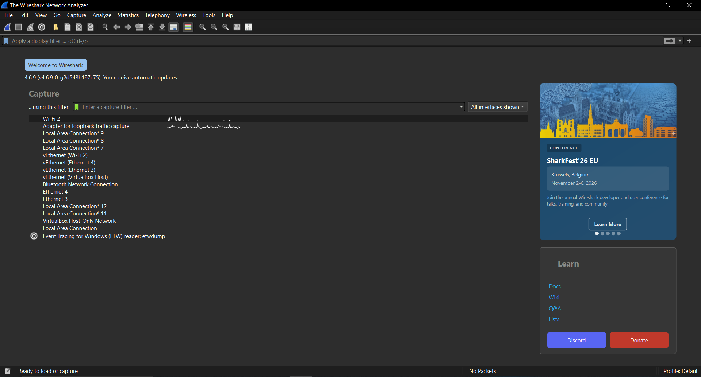
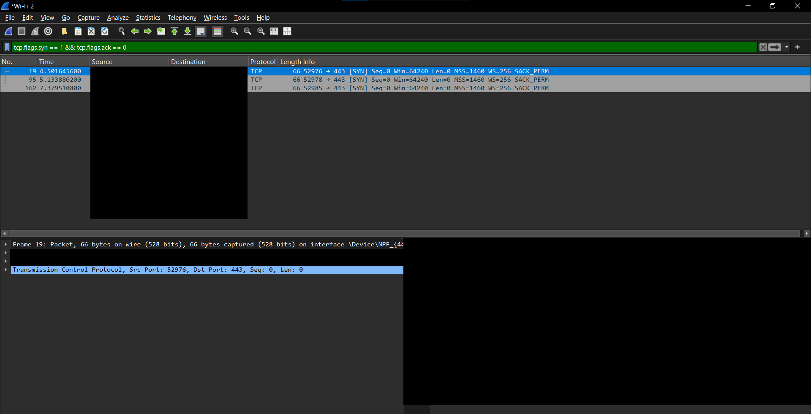
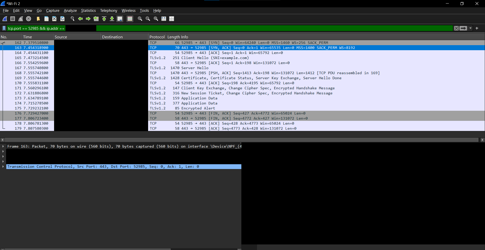
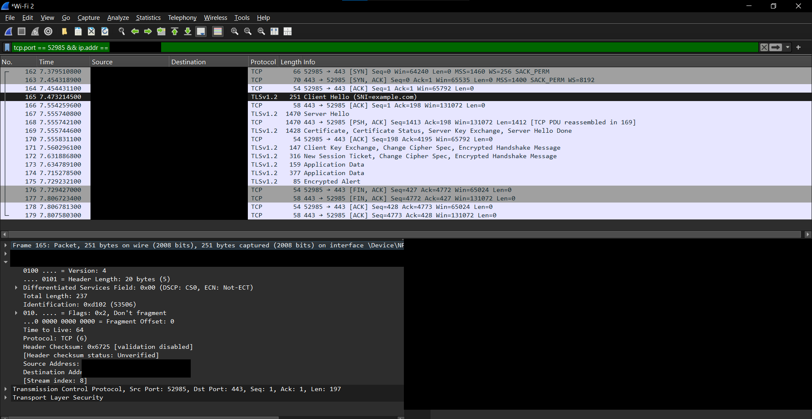
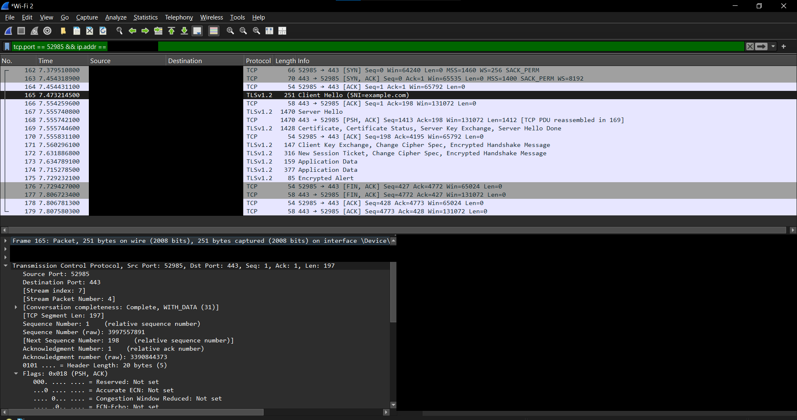
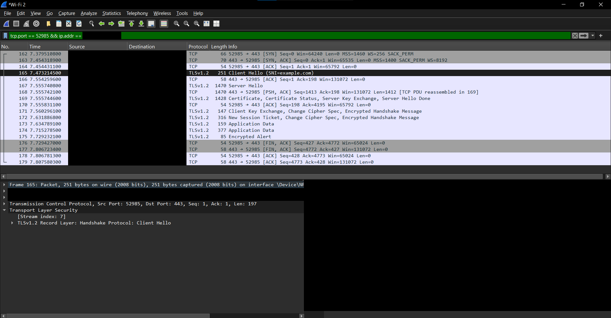

# Wireshark Lab: TCP 3-Way Handshake and Packet Analysis

## الهدف

التقاط بداية اتصال HTTPS مع `example.com` باستخدام Wireshark، وتحديد رسائل TCP الثلاث، ثم تحليل Packet واحدة طبقة بطبقة. التطبيق تم على واجهة `Wi-Fi 2` في Windows.

## 1. التقاط الاتصال

بدأت التسجيل على الواجهة النشطة `Wi-Fi 2`، ثم أنشأت اتصالًا بالموقع. بدأت بعرض رسائل SYN الأولى بهذا **Display Filter**:

```text
tcp.flags.syn == 1 && tcp.flags.ack == 0
```





ظهر طلب الاتصال في Packet **162** من الجهاز على المنفذ `52985` إلى السيرفر على المنفذ `443`. حجبت عناوين IP وMAC في صور التقرير. لعزل الاتصال في الالتقاط الأصلي يمكن اختيار إحدى رسائله ثم استخدام **Follow TCP Stream**، أو فلتر رقم الاتصال الذي يعرضه Wireshark:

```text
tcp.stream == 7
```

## 2. تحليل TCP 3-Way Handshake

| Packet | الاتجاه | TCP Flags | Seq / Ack | الدور |
| --- | --- | --- | --- | --- |
| **162** | الجهاز `:52985` → السيرفر `:443` | `SYN` | `Seq=0` | طلب إنشاء اتصال TCP. |
| **163** | السيرفر `:443` → الجهاز `:52985` | `SYN, ACK` | `Seq=0, Ack=1` | قبول الطلب وتأكيد استلام SYN. |
| **164** | الجهاز → السيرفر | `ACK` | `Seq=1, Ack=1` | تأكيد رد السيرفر؛ أصبح اتصال TCP جاهزًا لنقل البيانات. |

> أرقام Seq/Ack أعلاه هي **الأرقام النسبية** التي يعرضها Wireshark، وليست أرقام التسلسل الخام على السلك.



## 3. تحليل Packet 165: TLS Client Hello

بعد اكتمال TCP handshake ظهرت Packet **165** من الجهاز إلى السيرفر، وفيها `TLS Client Hello (SNI=example.com)`. اختيارها يوضح كيف تحمل الطبقات المختلفة نفس الرسالة:

| المستوى | القيمة المرصودة | التفسير |
| --- | --- | --- |
| Frame | **251 bytes** على السلك | حجم إطار Ethernet بالكامل كما سجله Wireshark. |
| Data Link (Ethernet II) | عنوانا MAC للمصدر والوجهة محجوبان | نقل الإطار للخطوة التالية على الشبكة المحلية. عنوان MAC للوجهة هنا ليس بالضرورة MAC للسيرفر البعيد. |
| Network (IPv4) | عنوانا المصدر والوجهة محجوبان؛ `TTL=64`؛ `Protocol=TCP (6)` | تحديد المصدر والوجهة على مستوى IP وتسليم الحمولة إلى TCP. إجمالي طول IP هو **237 bytes**. |
| Transport (TCP) | `52985` → `443`؛ `Seq=1, Ack=1`؛ `PSH, ACK`؛ `Len=197` | نقل **197 bytes** من بيانات TLS داخل اتصال TCP قائم، وليس محاولة جديدة لبدء اتصال. |
| TLS داخل TCP | `Client Hello`، والاسم `example.com` ظاهر في SNI | بدء التفاوض على تأمين الاتصال بعد اكتمال TCP handshake. ظهور `TLSv1.2 Record Layer` في Wireshark وصف للرسالة المعروضة؛ لا نحتاج استنتاج إصدار TLS النهائي من Client Hello وحده. |

الحساب بين الأحجام المرصودة: **251 bytes** للإطار = **14 bytes** Ethernet header + **237 bytes** IP packet. و**237 bytes** IP = **20 bytes** IP header + **20 bytes** TCP header + **197 bytes** TCP payload.







## الاستنتاج

- رسائل **SYN → SYN/ACK → ACK** في Packets 162–164 تنشئ اتصال **TCP**.
- رسالة **TLS Client Hello** في Packet 165 تأتي بعد ذلك لبدء التفاوض على حماية الاتصال؛ فهي ليست جزءًا من TCP 3-way handshake.
- Wireshark يعرض Frame وEthernet وIP وTCP وTLS، لكنه لا يعرض الطبقة الفيزيائية كـHeader مستقل، ولا يلزم أن تظهر طبقات OSI العليا الثلاث كحقول منفصلة.
- لعرض هذا الاتصال فقط استُخدم Display Filter؛ لم يغيّر بيانات الالتقاط الأصلية.

> صور النشر تحجب عناوين IP وMAC الظاهرة، وكذلك نافذة البايتات الخام لأنها تتضمن هذه العناوين بصيغة hex. لم يُرفق ملف الالتقاط الخام `.pcapng`.
