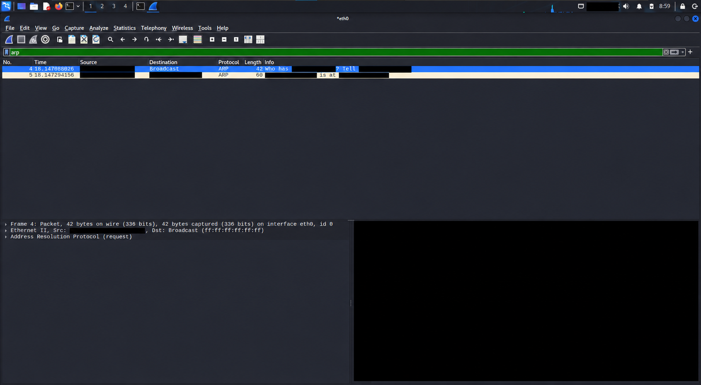
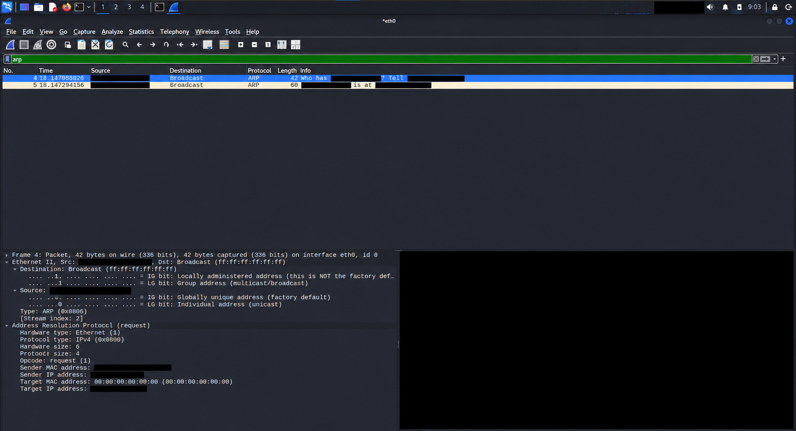
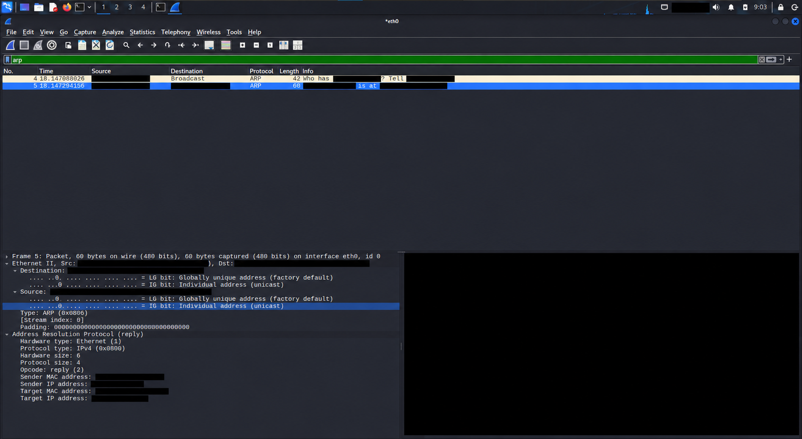
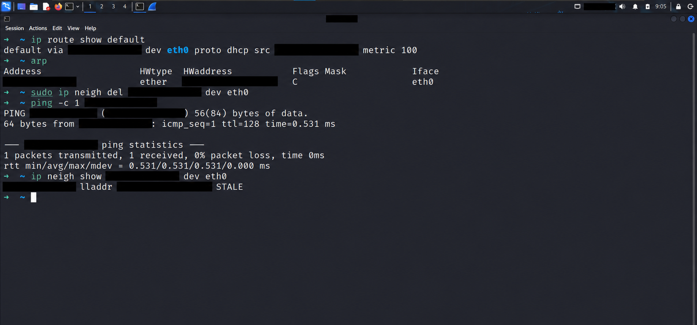

# ARP Traffic Capture & Analysis

**المسار:** Red Teaming Track — Week 02  
**البيئة:** Kali Linux داخل VMware — Interface: `eth0`  
**الأداة:** Wireshark

## 1. الهدف

مشاهدة كيف يعرف الجهاز عنوان MAC الخاص بالـDefault Gateway باستخدام ARP، وتحليل Request وReply، ثم التحقق من رجوع الإدخال إلى Neighbor Cache.

## 2. إعدادات التجربة

| العنصر | القيمة الفعلية |
|---|---|
| Client IP | `CLIENT_IP` |
| Client MAC | `CLIENT_MAC` |
| Default Gateway | `GATEWAY_IP` |
| Gateway MAC | `GATEWAY_MAC` |
| Interface | `eth0` |

هذه نسخة للنشر العام. استُبدلت عناوين IP وMAC الخاصة باللاب بقيم رمزية ثابتة. الصور المرفقة نسخ معدّلة بتغطية عناوين اللاب ومعرّفات الجهاز وجزء Hex/ASCII بمستطيلات معتمة. الصور للعرض التوضيحي؛ قد يتغير بعض النص الصغير أثناء تعديلها. التحليل والجداول أدناه مستندان إلى الصور الأصلية التي تمت مراجعتها، وهي المرجع للقيم والاتجاهات. الرموز ليست قيمًا فعلية ولا تُنسخ كما هي لتنفيذ الأوامر.

## 3. خطوات التنفيذ

### تحديد الـGateway وفحص الـCache

```bash
ip route show default
```

ظهر المسار التالي:

```text
default via GATEWAY_IP dev eth0 proto dhcp src CLIENT_IP metric 100
```

وكان إدخال الـGateway موجودًا في جدول ARP بعنوان MAC المذكور أعلاه.

### بدء الالتقاط وإعادة توليد ARP

بدأت الالتقاط على `eth0` في Wireshark واستخدمت Display Filter:

```wireshark
arp
```

الفلتر يخفي البروتوكولات الأخرى من العرض، لكنه لا يمنع التقاطها.

حذفت إدخال الـGateway فقط، ثم أرسلت Ping واحدة إليه:

```bash
sudo ip neigh del GATEWAY_IP dev eth0
ping -c 1 GATEWAY_IP
```

حذف الإدخال يجعل الجهاز يحتاج إلى إعادة معرفة MAC قبل إرسال حزمة IPv4 إلى الـGateway. لم أغيّر إعدادات IP أو المسار الافتراضي.

## 4. نظرة عامة على الالتقاط




| الحزمة | النوع | الرسالة |
|---|---|---|
| 4 | ARP Request | `Who has GATEWAY_IP? Tell CLIENT_IP` |
| 5 | ARP Reply | `GATEWAY_IP is at GATEWAY_MAC` |

## 5. تحليل Packet 4 — ARP Request




### Ethernet II

| الحقل | القيمة | المعنى |
|---|---|---|
| Source MAC | `CLIENT_MAC` | بطاقة شبكة جهاز Kali |
| Destination MAC | `ff:ff:ff:ff:ff:ff` | Broadcast داخل نطاق البث المحلي |
| EtherType | `0x0806` | الحمولة هي ARP |

### ARP

| الحقل | القيمة |
|---|---|
| Hardware Type | Ethernet — `1` |
| Protocol Type | IPv4 — `0x0800` |
| Hardware Size | 6 bytes |
| Protocol Size | 4 bytes |
| Opcode | Request — `1` |
| Sender MAC | `CLIENT_MAC` |
| Sender IP | `CLIENT_IP` |
| Target MAC | `00:00:00:00:00:00` |
| Target IP | `GATEWAY_IP` |

**التفسير:** جهاز Kali يعرف IP الـGateway، لكنه يحتاج إلى MAC الخاص به. لذلك أرسل سؤالًا إلى Broadcast.

**تمييز مهم:** Destination MAC في Ethernet هو Broadcast، بينما Target MAC داخل ARP أصفار لأنه مجهول. الحقلان يؤديان وظيفتين مختلفتين.

## 6. تحليل Packet 5 — ARP Reply




### Ethernet II

| الحقل | القيمة | المعنى |
|---|---|---|
| Source MAC | `GATEWAY_MAC` | الـGateway |
| Destination MAC | `CLIENT_MAC` | جهاز Kali — Unicast |
| EtherType | `0x0806` | ARP |

### ARP

| الحقل | القيمة |
|---|---|
| Hardware Type | Ethernet — `1` |
| Protocol Type | IPv4 — `0x0800` |
| Hardware Size | 6 bytes |
| Protocol Size | 4 bytes |
| Opcode | Reply — `2` |
| Sender MAC | `GATEWAY_MAC` |
| Sender IP | `GATEWAY_IP` |
| Target MAC | `CLIENT_MAC` |
| Target IP | `CLIENT_IP` |

**التفسير:** الـGateway أعلن عنوان MAC الخاص به ورد مباشرة إلى الجهاز الذي أرسل السؤال. الرد في هذه التجربة Unicast.

## 7. نتيجة الـPing والـCache




نجحت الـPing:

```text
1 packets transmitted, 1 received, 0% packet loss
rtt min/avg/max/mdev = 0.531/0.531/0.531/0.000 ms
```

هذه النتيجة تخص طلبًا واحدًا إلى الـGateway؛ لا تثبت أن الإنترنت بالكامل يعمل أو أن الشبكة لا تفقد حزمًا مطلقًا.

تحققت من رجوع الإدخال:

```bash
ip neigh show GATEWAY_IP dev eth0
```

```text
GATEWAY_IP lladdr GATEWAY_MAC STALE
```

**STALE:** الربط بين IP وMAC موجود، لكن تأكيد الوصول للجار لم يعد حديثًا. الحالة لا تعني فشل الاتصال؛ يمكن للنظام استخدام الإدخال وإعادة التحقق عند الحاجة.

## 8. ما تعلمته

- ARP يربط IPv4 بعنوان MAC على الشبكة المحلية.
- طلب ARP في التجربة Broadcast، والرد Unicast.
- ARP محمول مباشرة داخل Ethernet؛ لا يحتوي على TCP أو UDP Ports.
- `Protocol Type: IPv4` يحدد نوع العنوان الذي يحله ARP؛ لا يعني وجود IPv4 Header داخل حزمة ARP.
- للوصول إلى عنوان خارج الشبكة المحلية، يحل الجهاز MAC للـNext Hop المناسب، وغالبًا الـGateway، وليس MAC للسيرفر البعيد.
- بعد حذف إدخال الـGateway، ظهر Request ثم Reply، ونجحت الـPing، وعاد الربط إلى الـCache.