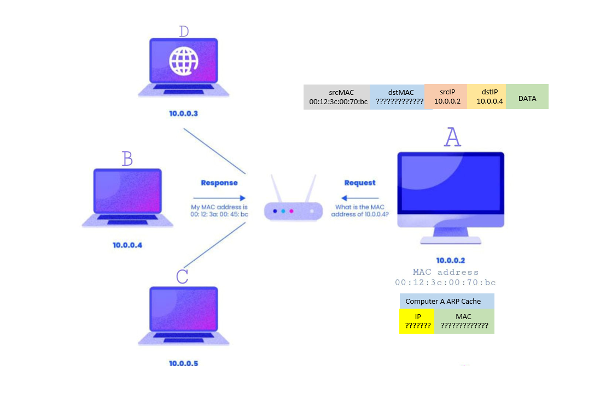
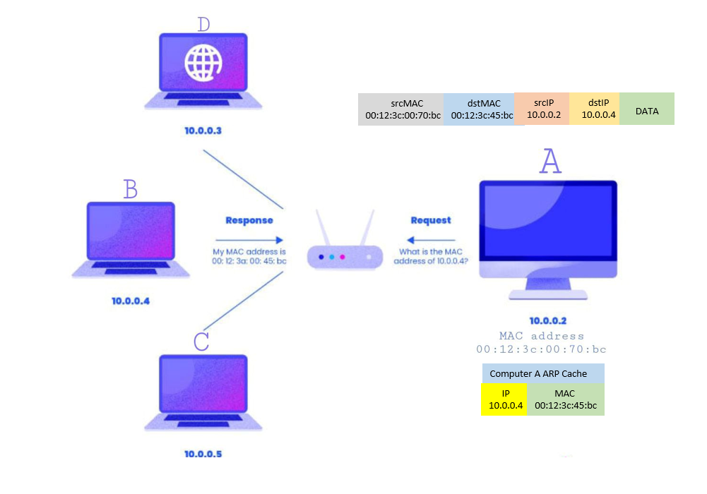

# 🔗 بروتوكول تحليل العنوان (ARP)

---

## 📖 ما هو ARP؟

بروتوكول تحليل العنوان (Address Resolution Protocol - ARP) يتيح للجهاز معرفة عنوان MAC المقابل لعنوان IPv4 للوجهة التالية داخل الشبكة المحلية. قد تكون الوجهة التالية جهازًا في نفس الشبكة أو الـDefault Gateway للوصول إلى شبكة أخرى.

> عناوين IP ليست دائمًا متغيرة؛ يمكن ضبطها ثابتة. وعناوين MAC يمكن تغييرها أو استخدام عناوين عشوائية بحسب الجهاز والإعدادات.

### لماذا نحتاج ARP؟

- عناوين IPv4 بطول 32 بت
- عناوين MAC بطول 48 بت
- ARP يبحث عن الربط بين عنوان IPv4 وعنوان MAC؛ لا يحوّل البِتات من طول إلى آخر، ولا يقوم بالبحث العكسي من MAC إلى IP.

> 💡 **ملاحظة مهمة**: عند إرسال بيانات IPv4 عبر Ethernet، يحتوي الـIP Packet على عنوانَي IP المصدر والوجهة، وتُغلَّف هذه الحزمة داخل Ethernet Frame يحتوي على عنوانَي MAC المصدر والوجهة التالية. رسائل ARP نفسها لها تنسيق مستقل ولا تُغلَّف داخل IP.

---

## 🔄 الفرق بين ARP Request و ARP Reply

### ARP Request (طلب ARP)

- يرسله الجهاز عندما لا يعرف عنوان MAC للجهاز المستهدف
- يُرسل عادةً كرسالة **Broadcast** داخل نفس نطاق البث، إلى عنوان MAC `ff:ff:ff:ff:ff:ff`
- يحتوي على عنوان IP للجهاز المطلوب

### ARP Reply (رد ARP)

- يرسله الجهاز المستهدف عندما يستلم طلب ARP
- في تبادل الطلب والرد المعتاد، يُرسل كرسالة **Unicast** مباشرة للجهاز الطالب
- يحتوي على عنوان MAC الخاص بالجهاز المستهدف

---

## 💾 وظيفة ARP Cache (جدول ARP)

جدول ARP هو ذاكرة مؤقتة تخزن عناوين IP المرتبطة بعناوين MAC.

### خصائص ARP Cache

- **محدود الحجم**: يحتوي على عدد محدود من الإدخالات
- **مؤقت للإدخالات الديناميكية**: مدة الاحتفاظ بها تختلف بحسب نظام التشغيل وحالة الإدخال؛ وقد توجد إدخالات ثابتة لا تنتهي بالطريقة نفسها
- **يتحدث تلقائيًا**: يتم تحديث الإدخالات الديناميكية أو إنهاؤها بحسب آلية النظام
- **على الأجهزة التي تستخدم ARP**: مثل الحواسيب والراوترات عند استخدام IPv4 عبر Ethernet

> ⚡ **الفائدة**: يسرع التواصل عن طريق تجنب إرسال طلبات ARP متكررة للأجهزة المعروفة.

---

## 📡 مثال: التواصل مع جهاز داخل نفس الشبكة

لنفهم العملية بشكل عملي، لنر مثالاً لجهازين A و B متصلين بنفس الشبكة:

### الخطوات

1. **المشكلة**: الجهاز A يريد إرسال رسالة للجهاز B، لكنه لا يعرف عنوان MAC الخاص بـ B
2. **البحث في الجدول**: الجهاز A يبحث في جدول ARP الخاص به عن معلومات الجهاز B
3. **إرسال ARP Request**: عندما لا يجد المعلومات، يرسل طلب ARP يحتوي على IP الخاص بـ B (مثلاً 10.0.0.4)
4. **Broadcast**: السويتش يمرر الطلب إلى المنافذ الأخرى المؤهلة داخل نفس الـVLAN، باستثناء منفذ وصوله
5. **استقبال الطلب**: الجهاز B يستقبل الطلب ويتحقق أنه هو المستهدف بناءً على عنوان IP
6. **ARP Reply**: الجهاز B يرد بعنوان MAC الخاص به إلى الجهاز A
7. **حفظ الربط والإرسال**: الجهاز A يحفظ الربط بين `10.0.0.4` والـMAC المستلم في ARP Cache، ثم يستخدمه لإرسال Ethernet Frame إلى B.

> الصورتان توضيح مبسط لتعلم MAC وحفظه، وليستا تمثيلًا حرفيًا لكل حقول رسالة ARP.

---

## 🌐 مثال: دور Gateway عند الوصول للإنترنت

عندما يريد الجهاز التواصل مع جهاز خارج الشبكة (على الإنترنت):

### العملية

1. الجهاز يتحقق أن الهدف IP خارج الشبكة المحلية
2. يفحص ARP Cache، وإذا لم يكن الربط صالحًا، يرسل ARP Request لمعرفة عنوان MAC الخاص بـ **Gateway** (الراوتر)
3. الـ Gateway يرد بعنوان MAC الخاص به
4. الجهاز يرسل Ethernet Frame وجهته MAC الخاص بالـGateway، بينما يظل عنوان IP الوجهة داخل الـPacket عنوان الجهاز البعيد
5. الـGateway يوجه الحزمة إلى الوجهة التالية، باستخدام إطار جديد مناسب للوصلة التالية. وقد تُعدَّل عناوين IP عند تطبيق NAT.

**مثال:** جهاز `192.168.1.10/24` يريد الوصول إلى `203.0.113.20`، والـGateway هو `192.168.1.1`. إذا لم يكن MAC الخاص بالـGateway محفوظًا، يستخدم ARP للبحث عن MAC المقابل لـ`192.168.1.1`، وليس عن MAC الخاص بـ`203.0.113.20`.

> 🎯 **النقطة المهمة**: للتواصل مع الإنترنت، الجهاز يحتاج فقط لمعرفة عنوان MAC الخاص بالـ Gateway، وليس عنوان MAC للجهاز النهائي على الإنترنت.

---

## 🏗️ مكان ARP في الشبكة

### طبقة OSI

يعمل ARP عند **طبقة Data Link Layer (الطبقة الثانية)** في نموذج OSI.

### الوظيفة

- يربط عناوين IPv4 (طبقة Network) بعناوين MAC (طبقة Data Link)
- يعمل بين الطبقتين لتمكين التواصل

### خصائص مهمة

- **لا يستخدم TCP أو UDP**: رسائل ARP لا تُنقل داخل بروتوكولات النقل
- **بروتوكول مستقل**: له بروتوكول خاص به (Ethertype 0x0806)
- **يعمل محلياً فقط**: لا ينتقل عبر الراوترات (يبقى داخل الشبكة المحلية)

---

## 📊 ملخص سريع

| المفهوم | الوصف |
| --------- | ------- |
| **ARP** | بروتوكول يربط IP بـ MAC |
| **ARP Request** | طلب Broadcast للحصول على MAC |
| **ARP Reply** | رد Unicast يحتوي على MAC |
| **ARP Cache** | جدول يربط عناوين IPv4 بعناوين MAC |
| **Gateway** | يحتاج الجهاز MAC الخاص به لإرسال البيانات إلى شبكة أخرى عبر Ethernet |
| **الطبقة** | Data Link Layer (لا يستخدم TCP/UDP) |

---

## 🎯 الخلاصة

ARP هو بروتوكول أساسي في الشبكات المحلية، يسمح للأجهزة بالتواصل من خلال ربط عناوين IP بعناوين MAC. في الحالة المعتادة، يستخدم الجهاز ARP لمعرفة MAC المطلوب قبل إرسال بيانات IPv4 عبر Ethernet؛ ويمكن الاستغناء عن تبادل ARP إذا كان الربط مضبوطًا يدويًا في جدول الجيران.

> 💡 **تذكر**: ARP يعمل فقط داخل الشبكة المحلية ولا ينتقل عبر الراوترات.

## ✅ مراجعة الفهم

- **ليه محتاج MAC مع وجود IP؟** الـIP يحدد الوجهة على مستوى الشبكات، والـMAC يحدد الوجهة التالية للإطار على الوصلة المحلية.
- **ليه ARP Request غالبًا Broadcast؟** لأن الجهاز يعرف IPv4 المطلوب لكنه لا يعرف MAC الخاص بصاحبه بعد.
- **لو الوجهة خارج الشبكة، نسأل عن MAC مين؟** الـDefault Gateway أو الـnext hop الذي اختاره جدول التوجيه.
- **هل ARP يستخدم Ports؟** لا؛ لا يستخدم TCP أو UDP.
- **هل IPv6 يستخدم ARP؟** لا؛ يستخدم Neighbor Discovery عبر ICMPv6.
