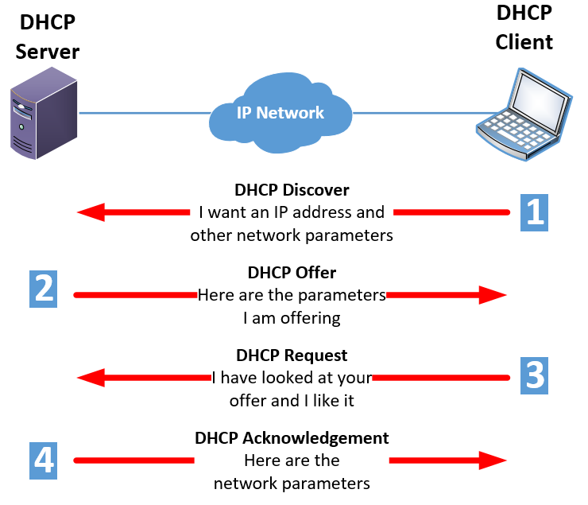
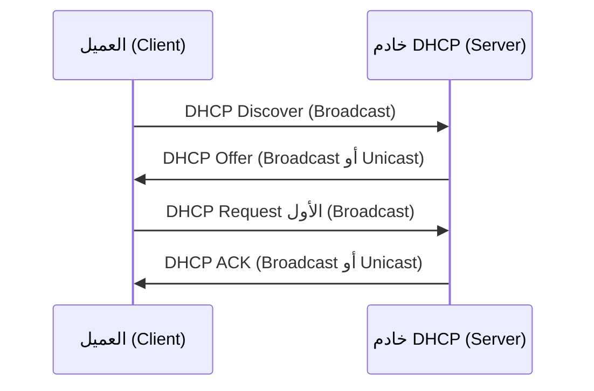

# 📡 دليل شامل لعملية DHCP - نموذج DORA

---

## 📖 مقدمة

بروتوكول التكوين الديناميكي للمضيف (DHCP) هو بروتوكول شبكة يتيح التعيين التلقائي لعناوين IP وإعدادات تكوين الشبكة الأخرى للأجهزة الموجودة على الشبكة. يمكن شرح عملية DHCP باستخدام الاختصار **DORA**، والذي يرمز إلى **الاكتشاف والعرض والطلب والإقرار**. يمثل هذا الاختصار الخطوات الأربع المتضمنة في عملية DHCP.

---

## 🔤 ما هو نموذج DORA؟

نموذج DORA هو الاختصار الذي يصف عملية تخصيص عنوان IP من خادم DHCP للعميل:

| الحرف | المرحلة | الوصف |
|-------|---------|-------|
| **D** | Discover | الاكتشاف |
| **O** | Offer | العرض |
| **R** | Request | الطلب |
| **A** | Acknowledge | الإقرار |

---

## 🔄 خطوات عملية DHCP (DORA)

### 1️⃣ الاكتشاف (Discover)

الخطوة الأولى في عملية DHCP هي مرحلة الاكتشاف. عندما يتصل جهاز (يشار إليه بعميل DHCP) بشبكة، فإنه يرسل رسالة بث تسمى **رسالة اكتشاف DHCP**.

- تُبث الرسالة داخل نطاق الـBroadcast المحلي لتصل إلى خادم DHCP مباشرة أو إلى DHCP relay ينقلها إلى خادم في شبكة أخرى.
- الغرض من هذه الرسالة هو تحديد موقع خادم DHCP متاح وطلب تعيين عنوان IP.
- في حالة الحصول الأول على عنوان، يكون عنوان IP المصدر غالبًا `0.0.0.0` والوجهة `255.255.255.255`، عبر UDP من منفذ العميل `68` إلى منفذ الخادم `67`.

> 💡 **ملاحظة**: العميل لا يعرف بعد عنوان IP الخاص به أو عنوان خادم DHCP، لذلك يستخدم البث.

### 2️⃣ العرض (Offer)

عند استلام رسالة DHCP Discover، تستجيب خوادم DHCP الموجودة على الشبكة برسالة **عرض DHCP**.

- تحتوي هذه الرسالة على عنوان IP متاح يرغب خادم DHCP في تعيينه للعميل.
- يمكن إرسال الـOffer كبث **Broadcast** أو كإرسال **Unicast** بحسب إعدادات البث في طلب العميل وسلوك الخادم/الـrelay؛ لا يمكن افتراض Unicast دائمًا. والعنوان المعروض اقتراح لم يبدأ العميل استخدامه بعد.
- قد يتلقى العميل عدة رسائل عرض DHCP في حالة وجود عدة خوادم DHCP على الشبكة.

### 3️⃣ الطلب (Request)

بمجرد أن يتلقى العميل رسائل عرض DHCP، فإنه يختار أحد العروض ويرسل رسالة **طلب DHCP** إلى خادم DHCP الذي قدم العرض.

- تؤكد هذه الرسالة قبول العميل لعنوان IP المقدم.
- عند اختيار عرض لأول مرة، يرسل العميل الـRequest عادةً كـ **Broadcast** ويضمّن هوية الخادم الذي اختاره والعنوان المطلوب؛ فتستطيع الخوادم الأخرى معرفة أن عروضها لم تُقبل.
- عند **تجديد** عنوان سبق منحه، قد يرسل العميل الـRequest مباشرةً (**Unicast**) إلى الخادم المعني؛ هذه حالة مختلفة عن طلب الاختيار الأول.

### 4️⃣ الإقرار (Acknowledge)

عند استلام رسالة طلب DHCP، يرسل خادم DHCP رسالة **إقرار DHCP** إلى العميل.

- تؤكد هذه الرسالة منح العنوان للعميل ومدة استخدامه. وقد يصل الـACK بطريقة Broadcast أو Unicast بحسب حالة العميل وإعدادات الإرسال.
- تحتوي رسالة إقرار DHCP على:
  - عنوان IP المعين للعميل
  - مدة التأجير (Lease Time)
  - إعدادات تكوين الشبكة الأخرى (Gateway, DNS, Subnet Mask)
- يقوم العميل بعد ذلك بتكوين واجهة الشبكة الخاصة به باستخدام عنوان IP المعين والإعدادات الأخرى الواردة في رسالة DHCP Acknowledge.

### لماذا الـOffer لا يعني أن الجهاز استلم العنوان؟

الـOffer مجرد **عرض مقترح**؛ قد يتلقى العميل عروضًا من أكثر من خادم. يحدد العميل اختياره في الـRequest، ثم يؤكد الخادم التأجير في الـACK. بعد التأكيد يستخدم العميل عنوان IP وإعدادات الشبكة الواردة فيه. إذا لم يصل ACK، لا يعتبر العميل العرض تأجيرًا مكتملًا، وقد يعيد المحاولة. وإذا رفض الخادم الطلب فقد يرد برسالة `DHCPNAK`، ويبدأ العميل الحصول على عنوان من جديد. عدم الحصول على عنوان بعد المحاولات قد يؤدي في Windows إلى عنوان محلي تلقائي `169.254.x.x`.

---

## 📊 مخطط تدفق عملية DORA

---

## 📝 مثال عملي

لتوضيح عملية DHCP، دعنا نفكر في مثال عملي:

| الخطوة | الإجراء |
| -------- | --------- |
| **1** | يتم تمهيد جهاز العميل ويرسل رسالة DHCP Discover إلى الشبكة. |
| **2** | تتلقى خوادم DHCP الموجودة على الشبكة رسالة Discover وتستجيب برسائل عرض DHCP، كل منها يحتوي على عنوان IP متاح. |
| **3** | يتلقى العميل عدة رسائل عرض DHCP ويختار أحد العروض. |
| **4** | يرسل العميل رسالة طلب DHCP إلى خادم DHCP الذي قدم العرض المحدد. |
| **5** | يتلقى خادم DHCP رسالة الطلب ويرسل رسالة إقرار DHCP إلى العميل، لتأكيد تعيين عنوان IP. |
| **6** | يقوم العميل بتكوين واجهة الشبكة الخاصة به باستخدام عنوان IP المعين والإعدادات الأخرى الواردة في رسالة DHCP Acknowledge. |

> ✅ هذا يكمل عملية DHCP، ويمكن لجهاز العميل الآن الاتصال على الشبكة باستخدام عنوان IP المعين.

---

## ⚙️ خطوات إضافية في DHCP

من المهم ملاحظة أنه أثناء عملية DHCP، قد تكون هناك خطوات إضافية متضمنة:

| الخطوة | الوصف |
| -------- | ------- |
| **تجديد عقد الإيجار (Lease Renewal)** | عادةً عند T1، أي نحو 50% من مدة التأجير، يحاول العميل التجديد مع الخادم الذي منحه العنوان. إذا لم يرد، قد يحاول إعادة الارتباط مع خوادم أخرى لاحقًا. |
| **تحرير العنوان (Lease Release)** | قد يرسل العميل DHCPRELEASE عندما يتخلى عن العنوان، لكن إيقاف الجهاز لا يضمن دائمًا إرسالها؛ تنتهي مدة التأجير لاحقًا إن لم يُجدَّد. |
| **اكتشاف التعارض (Conflict Detection)** | قد يجري العميل أو الخادم فحصًا لاكتشاف تعارض عنوان IP بحسب النظام والإعدادات؛ لا تفترض أن الخادم يتحقق دائمًا بالطريقة نفسها. |

هذه الخطوات تضمن إدارة فعالة لعنوان IP على الشبكة.

---

## 🎯 الخلاصة

تتضمن عملية DHCP، التي يمثلها الاختصار **DORA**، خطوات الاكتشاف والعرض والطلب والإقرار. تسمح هذه العملية بالتعيين التلقائي والفعال لعناوين IP وإعدادات تكوين الشبكة الأخرى للأجهزة الموجودة على الشبكة.

> 💡 **الفائدة الرئيسية**: يبسط DHCP عملية توصيل الأجهزة الجديدة بالشبكة ويقلل من الأخطاء البشرية في تكوين الشبكة.

---

## ❓ أسئلة وأجوبة

### أسئلة مراجعة الامتحان

- ما هو دور DHCP في الحفاظ على اتصال الشبكة في حالة تعطل خادم DHCP؟
- لماذا لا تزال عناوين IP الثابتة ذات صلة بأجهزة معينة، مثل الخوادم والطابعات؟
- كيف يبسط DHCP عملية توصيل الأجهزة الجديدة بالشبكة؟
- ما هو الغرض من DHCP في إدارة Windows Server؟

---

## 📚 معلومات إضافية

- **الحقل**: الأمن السيبراني
- **البرنامج**: إدارة خادم Windows EITC/IS/WSA
- **الدرس**: تكوين مناطق DHCP و DNS في Windows Server
- **الموضوع**: كيف يعمل DHCP في Windows Server
- **مراجعة الامتحان**

### الكلمات المفتاحية

الأمن السيبراني, DHCP, خادم DHCP, DORA, تعيين عنوان IP, شبكة بروتوكول

---

*تم تحديث هذا الدليل في أكتوبر 2026*
