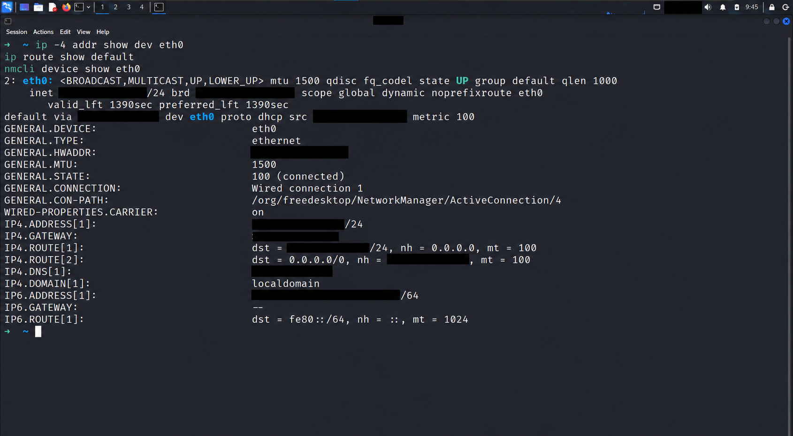

# DHCP Troubleshooting Scenario

**Red Teaming Track — Week 02**  
**البيئة:** Kali Linux داخل VMware — `eth0`  
**تاريخ الفحص:** 7 أكتوبر 2026

## 1. الهدف وحالة التجربة

توثيق إعداد IPv4 الحالي، ثم كتابة سيناريو تشخيص لجهاز لا يحصل على عنوان من DHCP.

> **الفحص الفعلي سليم من ناحية وجود الإعداد الديناميكي:** الجهاز لديه IPv4 ومسار افتراضي وDNS. سيناريو الفشل أدناه افتراضي؛ لم أُعطّل DHCP أو أقطع الاتصال ولم ألتقط DORA في هذا الفحص.

## 2. الفحص الفعلي — Baseline

```bash
ip -4 addr show dev eth0
ip route show default
nmcli device show eth0
```

### النتائج

| العنصر | الملاحظة الفعلية | التفسير |
|---|---|---|
| Interface | `eth0` | كارت الشبكة المستخدم |
| Link | `UP`, `LOWER_UP`, Carrier `on` | الواجهة مفعلة ويوجد Link |
| NetworkManager | `100 (connected)` | الاتصال مفعّل وفق NetworkManager |
| IPv4 | `CLIENT_IP/24` مع `dynamic` | عنوان ديناميكي، والقناع الموافق لـ`/24` هو `255.255.255.0` |
| Default Route | عبر `GATEWAY_IP`، مع `proto dhcp` | المسار الافتراضي الحالي موسوم بأنه من DHCP |
| DNS | `LOCAL_DNS`، يطابق عنوان الـGateway | إعداد DNS موجود؛ لا يثبت وحده هوية DHCP Server |
| Address Lifetime | `valid_lft 1390sec`, `preferred_lft 1390sec` | صلاحية متبقية وقت الفحص؛ ليست مدة الـLease الأصلية |
| MTU | `1500` | حجم MTU المضبوط على الواجهة |
| IPv6 | عنوان Link-local مع `/64` | لا يثبت وجود اتصال IPv6 بالإنترنت |

`CLIENT_IP` و`GATEWAY_IP` و`LOCAL_DNS` رموز لإخفاء إعدادات اللاب، وليست قيمًا تُنسخ إلى الأوامر.

### الصورة



الصورة نسخة معدّلة بتغطية عناوين IPv4 وMAC وعنوان IPv6 الخاص بالجهاز ومعرّفات سطح المكتب. التحليل مستند إلى الصورة الأصلية التي تمت مراجعتها؛ النسخة المعدّلة للعرض التوضيحي.

### حدود الاستنتاج

- توجد مؤشرات قوية على إعداد IPv4 ديناميكي حالي ومسار من DHCP.
- لا تعرض الصورة رسائل Discover أو Offer أو Request أو ACK.
- لا يظهر DHCP Server Identifier أو مدة Lease الأصلية أو قيم T1/T2.
- وجود عنوان وGateway لا يثبت وحده عمل الإنترنت أو صلاحية جميع إعدادات السيرفر.
- لم يظهر عنوان IPv4 Link-local من `169.254.0.0/16` في الفحص الفعلي.

## 3. مراجعة DORA

| المرحلة | دور الرسالة في الحصول الأولي على الإعداد |
|---|---|
| Discover | العميل يبحث عن DHCP Server |
| Offer | السيرفر يعرض عنوانًا وإعدادات |
| Request | العميل يطلب العرض الذي اختاره |
| ACK | السيرفر يؤكد الإعداد والـLease |

DHCPv4 يستخدم UDP: العميل على Port `68` والسيرفر على Port `67`. التجديد قد يستخدم Request وACK دون إعادة DORA بالكامل؛ لذلك غياب Discover في التقاط قصير لا يعني وجود عطل.

## 4. سيناريو عطل افتراضي

### العَرَض

واجهة Ethernet لديها Link، لكن العميل المضبوط للحصول على IPv4 تلقائيًا لا يحصل على عنوان مناسب لشبكة اللاب، ولا يوجد Default Gateway صالح. قد يبقى بلا IPv4 أو يحصل على IPv4 Link-local إذا كانت آلية fallback مفعلة؛ هذا السلوك ليس إلزاميًا في كل أنظمة Linux.

### الفحص وتفسير النتائج

| الخطوة | الفحص | الملاحظة الافتراضية | الاستنتاج |
|---|---|---|---|
| 1 | `ip -4 addr show dev eth0` | لا يوجد عنوان مناسب من شبكة اللاب | الإعداد المتوقع غير موجود؛ يلزم مراجعة طريقة إعداد الاتصال |
| 2 | `nmcli device show eth0` | Carrier `on` | يوجد Link؛ لا يثبت صحة VLAN أو مسار DHCP |
| 3 | مراجعة Connection Profile | IPv4 Method هو `auto` | العميل مضبوط لطلب الإعداد تلقائيًا |
| 4 | التقاط DHCPv4 | Discover متكرر ولا Offer ظاهر | لم يُرصد رد إلى العميل في الالتقاط؛ لا يثبت أن السيرفر متوقف |
| 5 | فحص السيرفر والشبكة | حسب الأدلة الإضافية | يحدد أين تعطلت الرسائل أو تخصيص العنوان |

أمر قراءة طريقة الإعداد، بعد استبدال `CONNECTION_NAME` باسم الاتصال الفعلي:

```bash
nmcli -g ipv4.method connection show "CONNECTION_NAME"
```

هذه خطوات مخططة؛ لم تُنفّذ حالة الفشل أو Capture الخاص بها في التجربة الحالية.

### فحص الرسائل في Wireshark

التقاط على الواجهة المناسبة ثم Display Filter عام لـDHCPv4:

```wireshark
udp.port == 67 || udp.port == 68
```

طابق الرسائل باستخدام Transaction ID وهوية العميل، بدل افتراض أن أي Offer ظاهر يخص جهازك. إذا لم يظهر Discover، راجع توقيت الالتقاط والواجهة وحالة العميل؛ فقد يكون في التجديد أو لم يبدأ الطلب بعد.

| النمط المرصود | اتجاه التشخيص |
|---|---|
| Discover بلا Offer | خدمة DHCP، نطاق العناوين، VLAN، Relay أو الفلترة ومسار الرد |
| Offer بلا Request | تحقق أن العرض يخص العميل، ثم راجع سلوك العميل والسجلات |
| Request بلا ACK | تحقق من وصول الطلب للسيرفر ومسار الرد وسياسات التخصيص |
| DHCP NAK | رفض صريح للإعداد المطلوب؛ تُراجع الرسالة وسياقها وسجلات السيرفر |
| ACK مع إعداد غير مناسب | راجع Options والسيرفر المرسل وإعداد Scope وGateway وDNS |

## 5. السبب المرجّح والفحوص الفاصلة

إذا تأكد أن العميل في الوضع التلقائي ويرسل Discover، ولا يصل Offer، فالسبب المرجّح مشكلة في خدمة DHCP أو مسار الرسائل، وليس DNS.

لتحديد السبب:

- مراجعة أن شبكة الـVM متصلة بالشبكة الافتراضية المقصودة وأن DHCP مفعّل فيها.
- فحص حالة خدمة DHCP والـScope وتوفر العناوين وسجلات التخصيص.
- مقارنة عميل آخر على نفس الشبكة: فشل عدة أجهزة يرجّح مشكلة مشتركة؛ نجاح جهاز آخر لا يستبعد اختلافًا في VLAN أو سياسات العميل.
- إذا كان السيرفر على شبكة مختلفة، مراجعة DHCP Relay والإعدادات والمسار.
- مقارنة التقاط جهة العميل وجهة السيرفر إن توفرت لتحديد هل الطلب وصل وهل الرد غادر.

## 6. الحل — بحسب السبب المثبت

1. تصحيح Connection Profile إلى IPv4 تلقائيًا إذا كان مضبوطًا خطأ.
2. إصلاح اتصال شبكة الـVM أو VLAN أو Relay إذا ثبت خلل المسار.
3. إصلاح خدمة DHCP أو نطاق العناوين وسياسات التخصيص إذا ثبت خلل السيرفر.
4. تصحيح DHCP Options إذا وصل ACK بإعداد غير مناسب.

لا يوضع Static IP عشوائي بوصفه إصلاحًا؛ قد يتعارض مع عنوان آخر ويخفي أصل المشكلة. إعادة الاتصال لتجديد الإعداد تُجرى فقط عند الحاجة وبعد تجهيز طريقة لاستعادة الاتصال.

**في الفحص الفعلي لم نحتج إلى أي تغيير أو Release/Renew.**

## 7. التحقق بعد الإصلاح — مخطط

```bash
ip -4 addr show dev eth0
ip route show default
nmcli device show eth0
```

معايير النجاح:

- حصول العميل على IPv4 مناسب مع Prefix صحيح.
- وجود Gateway وDNS متوافقين مع الشبكة المقصودة.
- تأكيد الـLease من سجلات العميل/السيرفر أو ACK عند توفر الأدلة.
- اختبار الوصول للـGateway، ثم DNS، ثم الخدمة المطلوبة كلٌّ بصورة منفصلة.

فشل Ping وحده لا يثبت غياب الاتصال؛ قد يكون ICMP محجوبًا. لا ندوّن أن الإصلاح نجح قبل تنفيذ التحقق فعليًا.

## 8. ربط السيناريو بالـOSI

DHCP بروتوكول في طبقة التطبيقات، لكنه يعتمد على UDP والاتصال الشبكي. Link يعمل مع فشل DHCP لا يستبعد مشكلة Layer 2 مثل VLAN، أو مشكلة Relay/توجيه، أو فلترة UDP، أو خدمة السيرفر نفسها.
