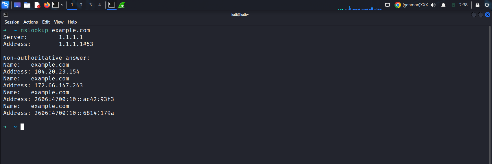
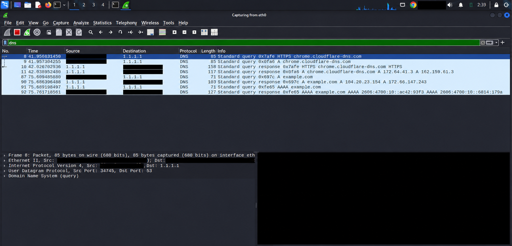
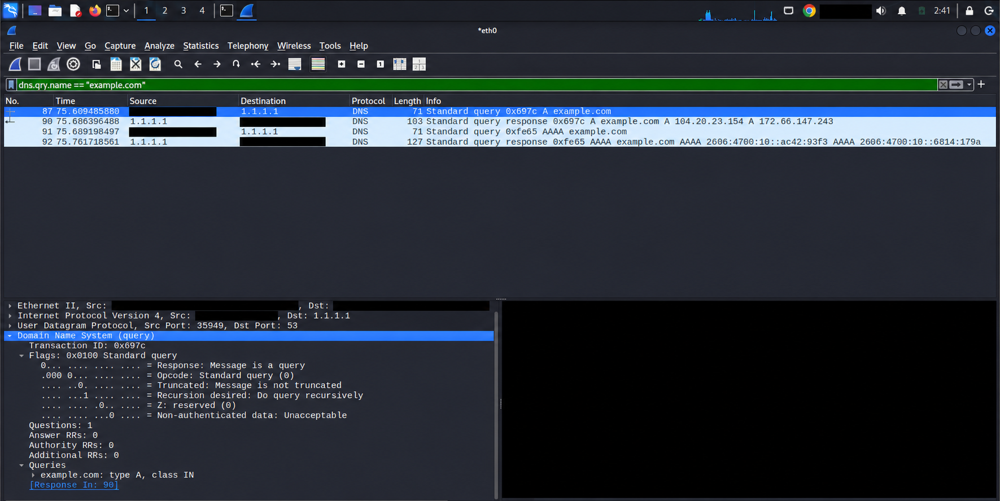
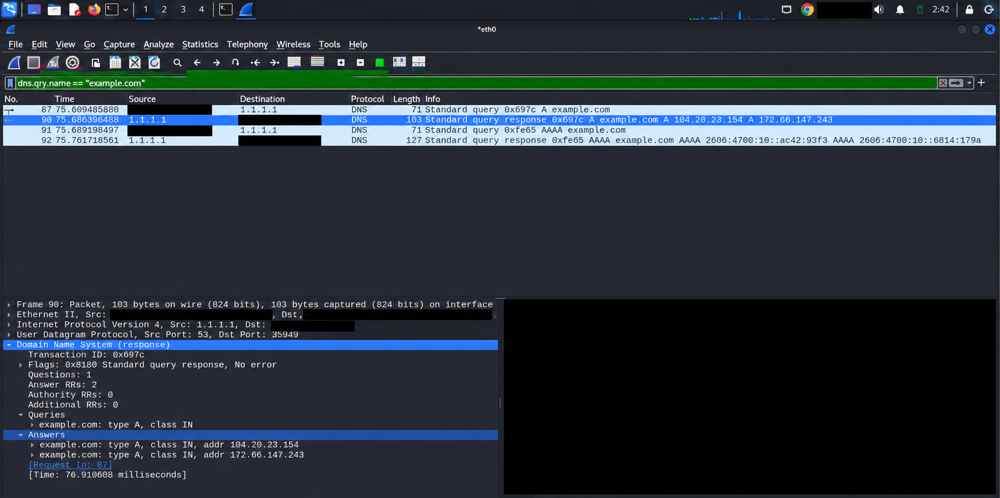
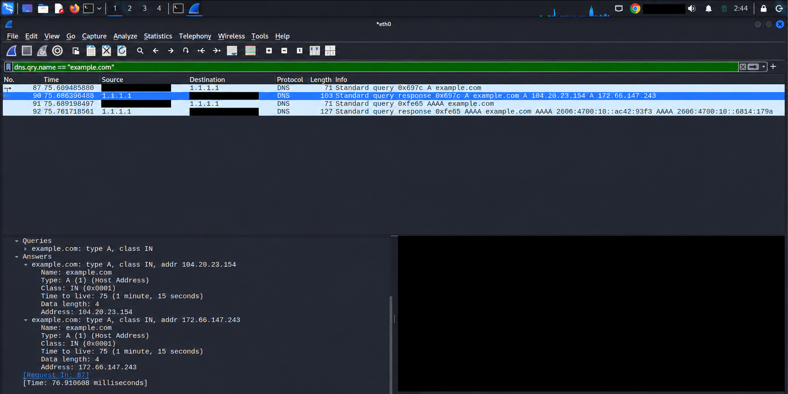

# DNS Traffic Capture — Wireshark & nslookup

**المسار:** Red Teaming Track  
**الأسبوع:** Week-02-DNS-DHCP-ARP-ICMP  
**البيئة:** Kali Linux داخل VMware  
**واجهة الالتقاط:** eth0

## 1. هدف التجربة

التقاط طلب DNS والرد عليه، وفهم كيفية حل اسم `example.com` إلى عناوين IPv4 وIPv6. التحليل مبني على صور التجربة الفعلية؛ ملف الالتقاط الخام غير مرفق.

## 2. الأدوات والخطوات

1. بدء الالتقاط في Wireshark على واجهة `eth0`.
2. تنفيذ الأمر التالي في الطرفية:

```bash
nslookup example.com
```

1. إيقاف الالتقاط بعد ظهور نتيجة الأمر.
2. عرض حركة DNS باستخدام الفلتر:

```wireshark
dns
```

1. حصر النتائج الخاصة بالتجربة باستخدام:

```wireshark
dns.qry.name == "example.com"
```

1. فتح تفاصيل الطلب رقم **87** والرد رقم **90**، ثم مراجعة سجلّي الإجابة تحت `Answers`.

## 3. نتيجة nslookup

```text
Server:         1.1.1.1
Address:        1.1.1.1#53

Non-authoritative answer:
Name:   example.com
Address: 104.20.23.154
Name:   example.com
Address: 172.66.147.243
Name:   example.com
Address: 2606:4700:10::ac42:93f3
Name:   example.com
Address: 2606:4700:10::6814:179a
```

| المعلومة | التفسير |
| --- | --- |
| Server = 1.1.1.1 | خادم DNS الذي استخدمه الاستعلام |
| #53 | منفذ خدمة DNS |
| Non-authoritative answer | الإجابة جاءت من Resolver، وليس بصفة إجابة authoritative عن النطاق |
| سجل A | يحمل عنوان IPv4 |
| سجل AAAA | يحمل عنوان IPv6 |

ظهور أكثر من عنوان في الرد يعني وجود أكثر من سجل للنوع المطلوب. لا يثبت وحده طريقة توزيع الحمل أو بنية الاستضافة.



## 4. نظرة عامة على الحزم

| Packet | الاتجاه | النوع | Transaction ID | النتيجة |
| --- | --- | --- | --- | --- |
| 87 | الجهاز → DNS Resolver | طلب A | 0x697c | طلب عناوين IPv4 لـexample.com |
| 90 | DNS Resolver → الجهاز | رد A | 0x697c | عنوانان IPv4 |
| 91 | الجهاز → DNS Resolver | طلب AAAA | 0xfe65 | طلب عناوين IPv6 لـexample.com |
| 92 | DNS Resolver → الجهاز | رد AAAA | 0xfe65 | عنوانان IPv6 |

الطلبات الأولى الخاصة بـ`chrome.cloudflare-dns.com` حركة أخرى ظهرت في الالتقاط، وليست جزءًا من تحليل استعلام `example.com`.



## 5. تحليل الطلب — Packet 87

### عناوين IP ومنافذ UDP

| الحقل | القيمة | المعنى |
| --- | --- | --- |
| Source IP | CLIENT_IP | عنوان جهاز Kali داخل الشبكة المحلية الافتراضية |
| Destination IP | 1.1.1.1 | عنوان DNS Resolver |
| Transport | UDP | بروتوكول النقل المستخدم في هذا الطلب |
| Source Port | 35949 | منفذ المصدر الخاص بهذا الاستعلام |
| Destination Port | 53 | منفذ خدمة DNS |

### تفاصيل DNS

| الحقل | القيمة | المعنى |
| --- | --- | --- |
| Transaction ID | 0x697c | معرّف يساعد على ربط الطلب بالرد |
| Flags | 0x0100 | طلب قياسي مع RD=1 |
| QR | 0 | الرسالة طلب Query |
| Opcode | 0 | Standard Query |
| RD | 1 | Recursion Desired: طلب من Resolver حل الاسم |
| TC | 0 | الرسالة غير مقتطعة |
| Questions | 1 | سؤال واحد |
| Answer RRs | 0 | لا توجد إجابات داخل الطلب |
| Name | example.com | النطاق المطلوب |
| Type | A | طلب عنوان IPv4 |
| Class | IN | Internet |

**الاستنتاج:** أرسل الجهاز طلب DNS عاديًا عبر UDP إلى المنفذ 53، طالبًا سجل A للنطاق.



## 6. تحليل الرد — Packet 90

| الحقل | القيمة | المعنى |
| --- | --- | --- |
| Source IP | 1.1.1.1 | الخادم الذي أرسل الرد |
| Destination IP | CLIENT_IP | الجهاز صاحب الطلب |
| Source Port | 53 | منفذ DNS على الخادم |
| Destination Port | 35949 | منفذ المصدر المستخدم في الطلب |
| Transaction ID | 0x697c | نفس معرّف الطلب رقم 87 |
| Flags | 0x8180 | رد قياسي ناجح مع RD=1 وRA=1 |
| QR | 1 | الرسالة Response |
| RCODE | 0 — No error | الاستعلام انتهى دون خطأ DNS |
| AA | 0 | الرد غير authoritative |
| RD | 1 | تكرار قيمة Recursion Desired من الطلب |
| RA | 1 | Resolver يدعم الاستعلامات التكرارية |
| Answer RRs | 2 | سجلان في قسم الإجابة |
| Response Time | 76.910608 ms | الوقت بين الطلب والرد كما رصده Wireshark |

**كيف ربطنا الطلب بالرد؟**

- Transaction ID متطابق: `0x697c`.
- عناوين IP والمنافذ انعكست بين الطلب والرد.
- السؤال هو `example.com` من النوع A في الرسالتين.
- Wireshark يعرض `Request In: 87` داخل الرد و`Response In: 90` داخل الطلب.

> Transaction ID وحده لا يكفي في كل الظروف؛ نراجعه مع العناوين والمنافذ والسؤال.



## 7. سجلات الإجابة وDNS TTL

| Name | Type | Class | Address | TTL | Data Length |
| --- | --- | --- | --- | --- | --- |
| example.com | A | IN | 104.20.23.154 | 75 ثانية | 4 بايت |
| example.com | A | IN | 172.66.147.243 | 75 ثانية | 4 بايت |

**DNS TTL = 75 ثانية:** يمكن للكاش العادي استخدام السجل خلال مدة الصلاحية المعلنة من وقت استلامه. بعد انتهاء المدة، يحتاج إجابة صالحة جديدة عند طلب السجل.

- انتهاء TTL لا يعني أن عنوان الموقع يجب أن يتغير.
- قد تكون القيمة التي أعادها Resolver هي المدة المتبقية لسجل موجود في كاشه؛ لا نستنتج TTL الأصلي من الصورة وحدها.
- قيمة 4 بايت هي حجم عنوان IPv4 داخل بيانات السجل، وليست حجم رسالة DNS كلها.

| المقارنة | DNS TTL | IPv4 TTL |
| --- | --- | --- |
| الوظيفة | تحديد صلاحية سجل DNS في الكاش | الحد من عمر الحزمة أثناء التوجيه |
| الوحدة العملية | ثوانٍ | تُنقص أثناء عبور الراوترات |
| مكان الحقل | سجل إجابة DNS | رأس حزمة IPv4 |



## 8. ماذا أثبتت التجربة؟

- نجح حل `example.com` في هذه التجربة.
- عناوين الردود في Wireshark تطابقت مع نتيجة nslookup.
- أمكن ربط طلب A بالرد عبر المعرّف والعناوين والمنافذ والسؤال.
- ظهرت طلبات وردود A وAAAA منفصلة.
- استخدم طلب A الذي حللناه UDP؛ DNS يمكن أن يستخدم TCP أيضًا.
- وجود جواب ناجح لا يثبت أن خدمة HTTP أو HTTPS تعمل.
- الالتقاط على جهاز العميل يُظهر اتصاله بالـResolver؛ لا يُظهر بالضرورة اتصالات Resolver مع Root وTLD وAuthoritative Servers، ولا يثبت أنه أجرى تلك الاتصالات بدل الإجابة من الكاش.
