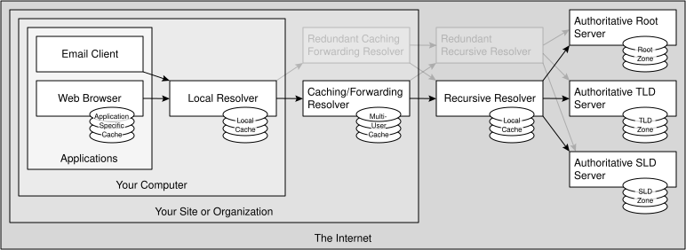
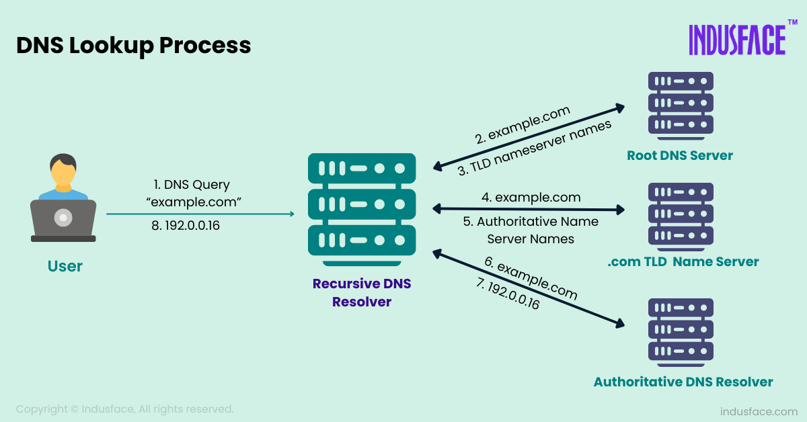

# 🌐 دليل شامل لنظام أسماء النطاقات (DNS)

---

## 📖 مقدمة

يُمثل نظام الـ DNS أو نظام أسماء النطاقات جزءًا أساسيًا من بنية شبكة الويب العالمية، إذ يشكل الأساس لعملية الاتصال ويؤثر بشكل كبير على تجربة المستخدم في الوصول إلى الإنترنت.

وعلى الرغم من أن العديد من أصحاب المواقع قد سمعوا بهذا المصطلح، إلا أن القليل منهم من يفهم تمامًا كيف يعمل أو كيفية إعداده بشكل صحيح.

وخلال هذا المقال، سنتعرف على إعدادات DNS، بالإضافة إلى كيفية إدارتها وتخصيصها لضمان تحسين أداء موقعك الإلكتروني بشكل فعال.

---

## 🔍 ما هو نظام الـ DNS؟

بشكل مبسط، نظام أسماء النطاقات (DNS) هو اختصار لـ **"Domain Name System"**، وهو النظام المسؤول عن تحويل أسماء نطاقات المواقع التي يسهل على المستخدمين قراءتها، مثل `example.com` إلى عناوين IP يسهل على الأجهزة فهمها، مثل `142.250.185.78`.

> 💡 **يمكن أن نعتبر نظام الـ DNS كدفتر عناوين الإنترنت**، إذ يتم ربط أسماء المواقع الإلكترونية بعناوين IP خاصة بها، مما يسمح للمستخدمين بالوصول إلى المواقع بسهولة من خلال كتابة اسم النطاق بدلًا من العنوان الرقمي.

---

## 🧩 ما هي مكونات DNS؟

لكي تفهم إعدادات DNS بشكل أفضل، فلا بد أن تتعرف على بعض المصطلحات والمكونات الأساسية في هذا النظام:

### 🖥️ خوادم الأسماء (Name Servers)

تمثل خوادم الأسماء الأجهزة التي تحتفظ بمعلومات الـ DNS لنطاق موقع معين. وبالتالي عندما يقوم المستخدم بإدخال عنوان أحد المواقع في المتصفح الخاص به، يتم إرسال طلب إلى خوادم الأسماء لتحديد عنوان الـ IP المرتبط بهذا النطاق.

يوجد لخوادم الأسماء **نوعان رئيسيان**:

| النوع | الوصف |
|-------|-------|
| **خوادم الأسماء الموثوقة** | تحتوي هذه الخوادم على المعلومات الرئيسية للموقع الإلكتروني، بالإضافة إلى أنها مسؤولة عن تقديم الإجابات الصحيحة على طلبات الـ DNS. |
| **خوادم الأسماء المؤقتة (Caching Name Servers)** | تعمل هذه الخوادم على تخزين المعلومات بشكل مؤقت، وذلك لتسريع عملية الوصول إلى المواقع التي تم طلبها سابقًا. |

### 📋 سجلات الـ DNS (DNS Records)

تشكل السجلات الجزء الأساسي من نظام الـ DNS، ومن خلالها يتم تحديد معلومات محددة عن نطاق معين. ومن أهم هذه السجلات:

#### 🔹 سجل A (Address Record)

يعمل هذا السجل على ربط اسم الدومين بعنوان IP خاص بخادم معين. على سبيل المثال، إذا كنت ترغب في ربط نطاق موقعك بموقع ويب معين، ستستخدم سجل A لتحديد عنوان IP الذي يستضيف الموقع.

#### 🔹 سجل CNAME

هو سجل يوفر اسمًا بديلًا داخل نظام الـ DNS لنطاق آخر، ويُستخدم في الغالب لربط نطاق فرعي مثل `www.example.com` بنطاق رئيسي، مثل `example.com`.

#### 🔹 سجل MX

يتم استخدام هذا السجل لتحديد خوادم البريد التي تتعامل مع البريد الإلكتروني المرتبط بالنطاق. ولا بد من إعداد هذا السجل بشكل صحيح، لضمان وصول البريد الإلكتروني بسلاسة.

#### 🔹 سجل TXT

يمكنك من خلال هذا السجل إضافة معلومات نصية إلى إعدادات DNS، وفي الغالب يتم استخدام هذا السجل للتحقق من ملكية الدومين أو لأغراض الأمان، مثل إضافة سجلات SPF/DKIM للبريد الإلكتروني.

> ✅ اختصارًا لما سبق، تمثل هذه المكونات العناصر الأساسية لإعدادات DNS، وهي ضرورية لفهم كيفية إدارة نطاق موقعك بشكل صحيح.

---

## ⚙️ كيف يعمل نظام أسماء النطاقات؟

عندما تقوم بإدخال اسم موقع ويب في المتصفح الخاص بك، فإن نظام الـ DNS يعمل على إيصالك بالموقع الذي تبحث عنه، وذلك عن طريق الأسماء أو الجمل التي كتبتها دون الحاجة إلى كتابة الـ IP.

هذه العملية تُعرف باسم **تحليل اسم النطاق (DNS Resolution)**، وتتم هذه العملية خطوة بخطوة:

### 🔄 عملية تحليل اسم النطاق

1. **في البداية**: يبدأ المتصفح بإرسال طلب إلى خادم الأسماء المؤقت الأقرب، وذلك ليتحقق مما إذا كان لديه معلومات مخزنة بشكل مؤقت حول اسم النطاق المطلوب.

2. **بعد ذلك**: عند غياب الإجابة من الـcache، يقوم الـrecursive resolver بالاستعلام من خوادم الجذر (Root)، ثم خوادم النطاق العلوي (TLD)، ثم خوادم الأسماء الموثوقة (Authoritative)، وبعدها يعيد الإجابة لجهازك.

3. **وفي النهاية**: يقوم خادم الأسماء الموثوق بإرجاع عنوان IP المرتبط بالنطاق إلى المتصفح. وبعد الحصول على عنوان الـ IP، يقوم المتصفح بإنشاء اتصال بالخادم المضيف وعرض المحتوى الذي قمت بالبحث عنه.

> 📌 **مثال للتوضيح**: عندما تقوم بالبحث عن اسم موقع في المتصفح، مثل البحث عن موقع استضافة المواقع الإلكترونية من كيميتوفا، فإنك سوف تصل إليه بشكل مباشر دون الحاجة إلى كتابة الـ IP، وذلك بعد مطابقة اسم النطاق في قائمة النطاقات المخزنة في النظام.

---

## 🛠️ كيفية إعداد DNS لاسم نطاقك؟

لكي تتمكن من إعداد نظام أسماء النطاقات لاسم موقعك، يجب أولاً الوصول إلى لوحة التحكم الخاصة بمزود خدمة النطاق الذي قمت بشراء نطاق موقعك منه. قد يكون المزود مثل **GoDaddy** أو **Namecheap** أو **Kemdtova**. قد تختلف الخطوات قليلًا بين مزود وآخر، لكن المبادئ العامة تبقى كما هي.

### 📝 خطوات الإعداد

#### الخطوة الأولى: اختيار خوادم الأسماء

يجب عليك أن تقوم باختيار خوادم الأسماء التي ستدير إعدادات DNS لنطاقك:

- إذا كنت تستخدم خدمات استضافة معينة، يمكنك استخدام خوادم الأسماء الخاصة بها.
- يمكنك أيضًا استخدام خوادم أسماء مخصصة، مثل **Cloudflare** للحصول على ميزات إضافية، مثل حماية موقعك من هجمات حجب الخدمة الموزعة DDoS.

#### الخطوة الثانية: تعديل السجلات

بعد أن يتم تعيين خوادم الأسماء، يمكنك البدء في تعديل السجلات المختلفة وإدارتها:

| السجل | الإجراء |
| ------- | --------- |
| **إضافة سجل A** | الانتقال إلى قسم "سجلات DNS" وإضافة سجل A جديد يشير إلى عنوان الـ IP الخاص بخادم الاستضافة. |
| **إعداد سجل MX** | إذا كنت ترغب في ضبط إعدادات البريد الإلكتروني المرتبطة باسم نطاق موقعك، فلا بد من إضافة سجل MX يشير إلى خادم البريد الخاص بك. |
| **إضافة سجل CNAME** | استخدام سجل CNAME لإعادة توجيه النطاق الفرعي `www.example.com` إلى النطاق الرئيسي `example.com`. |

---

## ⚠️ أهم الأخطاء الشائعة في إعدادات DNS وكيفية تجنبها؟

| الخطأ | الحل |
| ------- | ------ |
| ❌ إعداد خوادم الأسماء بشكل غير صحيح، مما يؤدي إلى مشاكل في الوصول إلى الموقع. | ✅ التأكد من توجيه خوادم الأسماء إلى المضيف الصحيح. |
| ❌ الأخطاء في إعدادات سجل MX تؤدي إلى مشاكل في تلقي البريد الإلكتروني. | ✅ التأكد من إدخال بيانات مزود خدمة البريد بشكل صحيح. |
| ❌ نسيان تحديث إعدادات نظام أسماء النطاقات عند تغيير مزود الاستضافة أو خدمة البريد الإلكتروني. | ✅ متابعة التحديثات وإجراء التعديلات اللازمة في الوقت المناسب. |

---

## 🔒 أمان الـ DNS (DNS Security)

مع تزايد التهديدات السيبرانية، أصبح أمان الـ DNS أمرًا بالغ الأهمية. هناك عدة تقنيات لحماية استعلامات الـ DNS:

### 🛡️ DNSSEC (Domain Name System Security Extensions)

هي مجموعة من المواصفات التي تضيف أمانًا تشفيريًا لبروتوكول الـ DNS، مما يمنع هجمات التزييف وضمان مصداقية البيانات.

### 🔐 DNS over HTTPS (DoH)

تقوم بتشفير استعلامات الـ DNS باستخدام بروتوكول HTTPS، مما يوفر خصوصية إضافية ويمنع المراقبة أو التلاعب بالاستعلامات.

### 🔐 DNS over TLS (DoT)

تشبه تقنية DoH ولكنها تستخدم بروتوكول TLS لتشفير استعلامات الـ DNS، مما يوفر أيضًا حماية إضافية للخصوصية.

---

## 🌍 انتشار الـ DNS (DNS Propagation)

عند إجراء تغييرات على إعدادات الـ DNS، لا يتم تطبيقها فورًا على مستوى العالم. هذه العملية تسمى **"انتشار الـ DNS"**.

يعتمد ظهور التغيير على:

| العامل | التأثير |
|--------|---------|
| **قيمة TTL (Time To Live)** | تحدد المدة التي يجب أن يحتفظ بها خادم الـ DNS بالمعلومات قبل طلب تحديثها. |
| **خوادم الـ DNS المؤقتة** | قد تستمر بعض الخوادم في استخدام المعلومات القديمة حتى تنتهي فترة الـ TTL. |

لا توجد مدة ثابتة لكل تغييرات DNS؛ ظهور التغيير يتأثر خصوصًا بالـTTL والـcache.

---

## 🔧 أدوات استكشاف أخطاء الـ DNS وإصلاحها

لمساعدتك في تشخيص مشاكل الـ DNS، يمكنك استخدام الأدوات التالية:

| الأداة | الوصف |
| -------- | ------- |
| **nslookup** | أداة سطر أوامر تتيح لك الاستعلام عن سجلات الـ DNS وتحديد المشاكل المحتملة. |
| **dig** | أداة متقدمة للاستعلام عن خوادم الـ DNS وتوفير معلومات تفصيلية عن السجلات. |
| **ping** | أداة بسيطة لاختبار الاتصال بخادم معين والتحقق من دقة عنوان الـ IP. |
| **traceroute** | تساعدك في تتبع المسار الذي تتخذه الحزم من جهازك إلى الخادم الهدف، مما يكشف عن أي مشاكل في المسار. |

---

## ✅ أفضل ممارسات إدارة الـ DNS

لضمان إدارة فعالة لنظام الـ DNS، اتبع هذه الممارسات:

1. ✨ استخدم خوادم أسماء موثوقة، مثل **Cloudflare** أو **Google Public DNS**.
2. 👀 راقب إعدادات الـ DNS بانتظام للتأكد من دقتها وحداثتها.
3. 💾 احتفظ بنسخ احتياطية من إعدادات الـ DNS الخاصة بك.
4. ⚖️ استخدم قيم TTL مناسبة لتوازن بين سرعة التحديث وتقليل الحمل على الخوادم.
5. 🛡️ فعّل تقنيات الأمان مثل DNSSEC و DoH لحماية خصوصيتك وأمان موقعك.

---

## 📚 الخلاصة

يُعد نظام أسماء النطاقات (DNS) العمود الفقري للإنترنت، حيث يربط أسماء النطاقات البشرية بعناوين IP التقنية. فهم كيفية عمل هذا النظام وإعداداته أمر ضروري لأي صاحب موقع إلكتروني.

### 🎯 ما تعلمناه في هذا المقال

- تعريف نظام الـ DNS وأهميته في عملية الاتصال بالإنترنت.
- المكونات الأساسية للنظام مثل خوادم الأسماء والسجلات المختلفة (A, CNAME, MX, TXT).
- كيفية عمل عملية تحليل اسم النطاق خطوة بخطوة.
- طريقة إعداد الـ DNS لنطاقك من خلال لوحة التحكم.
- الأخطاء الشائعة وكيفية تجنبها.
- تقنيات أمان الـ DNS الحديثة (DNSSEC, DoH, DoT).
- مفهوم انتشار الـ DNS وعوامل التأثير فيه.
- أدوات استكشاف الأخطاء وإصلاحها.
- أفضل الممارسات لإدارة الـ DNS بفعالية.

> 💡 من خلال تطبيق هذه المعرفة، يمكنك تحسين أداء موقعك الإلكتروني، ضمان استقراره، وحمايته من التهديدات السيبرانية. تذكر دائمًا أن إدارة الـ DNS بشكل صحيح ليست مجرد تقنية، بل هي استثمار في تجربة المستخدم وأمان موقعك.
