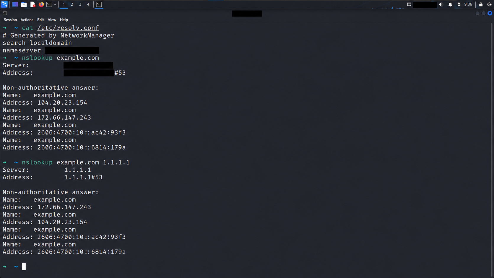

# DNS Troubleshooting Scenario

**Red Teaming Track — Week 02**  
**البيئة:** Kali Linux داخل VMware  
**تاريخ الاختبار:** 7 أكتوبر 2026

## 1. الهدف

تشخيص مشكلة حل أسماء النطاقات بمقارنة الـDNS الافتراضي مع Resolver محدد، وفصل الأدلة الفعلية عن سيناريو العطل الافتراضي.

> **حالة التجربة:** الاستعلامان الفعليان نجحا. لم يحدث Timeout ولم أغيّر إعدادات DNS. سيناريو العطل أدناه تدريبي افتراضي، وليس حادثة حقيقية.

## 2. الفحص الفعلي — Baseline

نفّذت:

```bash
cat /etc/resolv.conf
nslookup example.com
nslookup example.com 1.1.1.1
```

ظهر أن ملف الإعدادات مولَّد بواسطة NetworkManager، وأن الـDNS الافتراضي عنوان محلي يطابق عنوان الـGateway في اللاب. استُبدل عنوانه هنا بالرمز `LOCAL_DNS` لحماية خصوصية إعدادات الشبكة.

```text
# Generated by NetworkManager
search localdomain
nameserver LOCAL_DNS
```

`LOCAL_DNS` رمز توثيقي وليس عنوانًا يُستخدم مباشرة في الأوامر.

### النتائج

| الفحص | النتيجة الفعلية |
|---|---|
| DNS الافتراضي | استجابة ناجحة باسم `example.com` وعناوين IPv4 وIPv6 |
| Resolver المحدد `1.1.1.1` | استجابة ناجحة بنفس مجموعة العناوين |
| ترتيب عناوين IPv4 | مختلف بين الاستجابتين؛ ليس دليلًا على عطل |
| نوع الاستجابة | `Non-authoritative answer` في الحالتين |

العناوين العامة التي ظهرت وقت الاختبار:

| نوع السجل | القيمة |
|---|---|
| A | `104.20.23.154` |
| A | `172.66.147.243` |
| AAAA | `2606:4700:10::ac42:93f3` |
| AAAA | `2606:4700:10::6814:179a` |

هذه نتائج زمن الاختبار وليست قيمًا يجب أن تبقى ثابتة مستقبلًا.

### صورة النتائج



الصورة نسخة معدّلة لإخفاء عنوان الـDNS المحلي ومعرّفات الجهاز. التحليل يستند إلى الصورة الأصلية التي تمت مراجعتها؛ النسخة المعدّلة للعرض التوضيحي.

### تفسير الأدلة

- الـDNS الافتراضي نجح في حل الاسم أثناء الاختبار.
- الاستعلام الموجّه إلى `1.1.1.1` نجح أيضًا. تحديد السيرفر في الأمر لا يغيّر DNS النظام.
- `Non-authoritative answer` لا تعني خطأ؛ الاستجابة لم تكن إجابة Authoritative للنطاق من السيرفر المستعلم منه.
- وجود إجابة AAAA لا يثبت أن اتصال IPv6 من الجهاز يعمل.
- نجاح DNS لا يثبت أن الموقع نفسه متاح عبر HTTPS، ولا يكشف وحده سلسلة الاستعلام كاملة بين Resolver وRoot وTLD وAuthoritative servers.

## 3. سيناريو العطل — افتراضي

### العَرَض

المستخدم لا يستطيع فتح مواقع بأسمائها ويظهر خطأ متعلق بحل الاسم. نفترض في هذا السيناريو أن الاستعلام الافتراضي ينتهي بـTimeout، بينما الاستعلام لنفس الاسم عبر Resolver بديل ينجح.

### الفحص

| الخطوة | الفحص | النتيجة المفترضة | ماذا تعني؟ |
|---|---|---|---|
| 1 | مراجعة `/etc/resolv.conf` | وجود DNS محلي مضبوط | يحدد السيرفر الذي يستخدمه `nslookup` افتراضيًا |
| 2 | `nslookup example.com` | Timeout | لم تصل استجابة DNS في المهلة؛ السبب لم يتحدد بعد |
| 3 | `nslookup example.com 1.1.1.1` | إجابة ناجحة | توجد قدرة على إجراء استعلام DNS عبر مسار بديل |
| 4 | تكرار المقارنة لأكثر من نطاق عام | نفس الاختلاف | يرجّح مشكلة عامة في المسار الافتراضي بدل مشكلة في نطاق واحد |

هذه النتائج المفترضة ليست مخرجات الأوامر الفعلية في القسم السابق.

### السبب المرجّح

مشكلة في الـDNS الافتراضي أو الوصول إليه أو خدمة الـForwarding التي يقدمها. لا يكفي Timeout وحده للجزم بأن السيرفر متوقف.

أسباب محتملة تحتاج إلى إثبات:

- إعداد عنوان DNS غير صحيح أو قديم.
- خلل بخدمة الـDNS المحلية أو الاتصال بخوادمها الخارجية.
- فلترة لحركة DNS أو مشكلة توجيه/فقد حزم على المسار.

### فحوص إضافية لتحديد السبب

- مراجعة IP والمسار الافتراضي باستخدام `ip addr` و`ip route`.
- التحقق من الوصول إلى الـDNS المحلي. فشل Ping وحده لا يثبت أنه متوقف؛ قد يكون ICMP محجوبًا.
- التقاط `dns` في Wireshark: هل خرج Query؟ هل وصل Reply؟ هل يوجد Response Code؟
- مقارنة UDP وTCP عند الحاجة باستخدام `dig`، بعد استبدال `LOCAL_DNS` بعنوان اللاب الحقيقي:

```bash
dig @LOCAL_DNS example.com A
dig +tcp @LOCAL_DNS example.com A
```

نجاح TCP وفشل UDP يرجّح اختلافًا في التعامل مع النقل، لكنه لا يحدد وحده موضع الفلترة.

### الحل المقترح — حسب السبب المثبت

1. تصحيح إعداد DNS عبر NetworkManager أو إعدادات الاتصال إذا كان العنوان غير صحيح. لا يُفضّل تعديل ملف مولَّد تلقائيًا دون فهم من يديره.
2. إصلاح خدمة الـDNS/Forwarding أو مسار الاتصال بها إذا ثبت الخلل.
3. يمكن استخدام Resolver بديل معتمد مؤقتًا في لاب شخصي. في شبكة شركة، لا تغيّر DNS عشوائيًا لأن أسماء الخدمات الداخلية قد تحتاج DNS المؤسسة.

**لم تُنفّذ أي تغييرات في التجربة الفعلية؛ لأنها كانت سليمة.**

### التحقق بعد الإصلاح — خطوات مخططة

```bash
nslookup example.com
```

يجب نجاح الاستعلام الافتراضي بعد الإصلاح، مع مراجعة أن السيرفر المستخدم هو المقصود. ثم تُجرّب نطاقات عامة أخرى وأسماء داخلية إن وجدت، ويُختبر فتح الموقع عبر المتصفح للتحقق من خدمة الويب بصورة منفصلة.

لا نكتب «تم الإصلاح» أو نرفق نتيجة نجاح جديدة قبل تنفيذ التحقق فعليًا.

## 4. تمييز الأخطاء

| النتيجة | معناها |
|---|---|
| Timeout | لم تصل استجابة في المهلة |
| NXDOMAIN | رد يفيد بأن اسم النطاق المطلوب غير موجود |
| SERVFAIL | السيرفر فشل في إتمام معالجة الاستعلام |
| Non-authoritative answer | إجابة غير Authoritative؛ ليست رسالة خطأ |

## 5. ربط السيناريو بالـOSI

DNS بروتوكول في طبقة التطبيقات، لكن سبب فشل استعلامه قد يكون في الاتصال أو التوجيه أو الفلترة. لذلك لا نختزل كل Timeout في مشكلة Layer 7.

